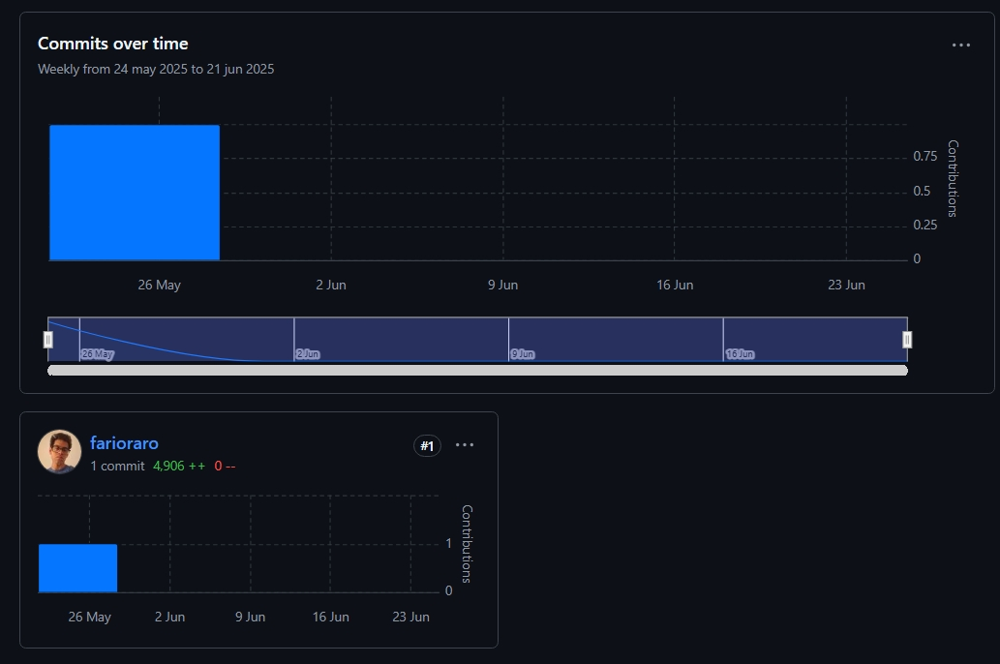

<div align="center">

**Universidad Peruana de Ciencias Aplicadas - Ingeniería de Software**


## 1ASI0728 - Arquitectura de Software Emergentes

Docente: Christian Luis De Los Rios Fernandez
Informe TB2

Startup: CampArquiUpc
Producto: PonteBarbón

<br/>

### Team Members

| Estudiante                      | Código    |
| ------------------------------- | ---------- |
| Morales Quispe, Brayan Smith    | 202317638  |
| Quispe Condori, Fernando Daniel | u20221c628 |
| Ochoa Colonio, Carlos Alberto   | u20231595  |

<br/>

 2025-01

</div>

<div style="page-break-before: always"></div>

# Registro de Versiones del Informe

| Versión | Fecha      | Autor           | Descripción de la modificación                                                      |
| -------- | ---------- | --------------- | ------------------------------------------------------------------------------------- |
| 1.0      | 13/04/2025 | Fernando Quispe | Análisis competitivo identificando los principales competidores de nuestro producto. |
| 1.1      | 15/04/2025 | Brayan Morales  | Needfinding process, C4 Architecture                                                  |
| 1.2      | 17/04/2025 | Carlos Ochoa    | Event storming process, Redacción del capítulo 1.                                   |

<div style="page-break-before: always"></div>

# Project Report Collaboration Insights

* URL del repositorio del Project Report en la organización de GitHub del equipo:
* [Link de la organización](https://github.com/CampArquiUpc)

<div style="page-break-before: always"></div>

# Contenido

<!-- TOC -->

- [Registro de Versiones del Informe](#registro-de-versiones-del-informe)
- [Project Report Collaboration Insights](#project-report-collaboration-insights)
- [Contenido](#contenido)
- [Student Outcome](#student-outcome)
- [Capítulo I: Presentación](#capítulo-i-presentación)
  - [1.1. Startup Profile](#11-startup-profile)
    - [1.1.1. Descripción de la Startup](#111-descripción-de-la-startup)
    - [1.1.2. Perfiles de los integrantes del equipo](#112-perfiles-de-los-integrantes-del-equipo)
  - [1.2. Solution Profile](#12-solution-profile)
    - [1.2.1. Antecedentes y problemática](#121-antecedentes-y-problemática)
    - [1.2.2. Lean UX Process](#122-lean-ux-process)
      - [1.2.2.1. Lean UX Problem Statements](#1221-lean-ux-problem-statements)
      - [1.2.2.2. Lean UX Assumptions](#1222-lean-ux-assumptions)
      - [1.2.2.3. Lean UX Hypothesis Statements](#1223-lean-ux-hypothesis-statements)
      - [Asesoría Financiera Personalizada](#asesoría-financiera-personalizada)
      - [Educación Financiera Continua](#educación-financiera-continua)
      - [Interacción con Chatbot](#interacción-con-chatbot)
      - [Visualización de Progreso Financiero](#visualización-de-progreso-financiero)
      - [Facilidad de Uso](#facilidad-de-uso)
      - [Confianza y Privacidad](#confianza-y-privacidad)
      - [1.2.2.4. Lean UX Canvas](#1224-lean-ux-canvas)
  - [1.3. Segmentos objetivo](#13-segmentos-objetivo)
- [Capítulo II: Requirements Elicitation \& Analysis](#capítulo-ii-requirements-elicitation--analysis)
  - [2.1. Competidores](#21-competidores)
    - [2.1.1. Análisis competitivo](#211-análisis-competitivo)
    - [2.1.2. Estrategias y tácticas frente a competidores](#212-estrategias-y-tácticas-frente-a-competidores)
      - [1. Diferenciación por tecnología emergente](#1-diferenciación-por-tecnología-emergente)
      - [2. Enfoque de nicho definido](#2-enfoque-de-nicho-definido)
      - [3. Modelo Freemium para escalar usuarios](#3-modelo-freemium-para-escalar-usuarios)
      - [4. Rapidez en iteración y mejoras](#4-rapidez-en-iteración-y-mejoras)
      - [5. Alianzas estratégicas con bancos y comercios](#5-alianzas-estratégicas-con-bancos-y-comercios)
      - [6. Mitigación de amenazas](#6-mitigación-de-amenazas)
  - [2.2. Entrevistas](#22-entrevistas)
    - [2.2.1. Diseño de entrevistas](#221-diseño-de-entrevistas)
    - [2.2.2. Registro de entrevistas](#222-registro-de-entrevistas)
    - [2.2.3. Análisis de entrevistas.](#223-análisis-de-entrevistas)
  - [2.3. Needfinding](#23-needfinding)
    - [2.3.1. User Person](#231-user-person)
    - [2.3.2. User Task Matrix](#232-user-task-matrix)
    - [2.3.3. Empathy Mapping](#233-empathy-mapping)
    - [2.3.4. As-is](#234-as-is)
  - [2.4. Ubiquitous Language](#24-ubiquitous-language)
- [Capítulo III: Requirements specification](#capítulo-iii-requirements-specification)
  - [3.1. To-Be Scenario Mapping](#31-to-be-scenario-mapping)
  - [3.2. User Stories](#32-user-stories)
  - [3.3. Impact Mapping](#33-impact-mapping)
  - [3.4. Product Backlog](#34-product-backlog)
- [Capítulo IV: Strategic-Level Software Design.](#capítulo-iv-strategic-level-software-design)
  - [4.1. Strategic-Level Attribute-Driven Design.](#41-strategic-level-attribute-driven-design)
    - [4.1.1. Design Purpose.](#411-design-purpose)
    - [4.1.2. Attribute-Driven Design Inputs.](#412-attribute-driven-design-inputs)
      - [4.1.2.1. Primary Functionality (Primary User Stories).](#4121-primary-functionality-primary-user-stories)
      - [4.1.2.2. Quality attribute Scenarios.](#4122-quality-attribute-scenarios)
      - [4.1.2.3. Constraints.](#4123-constraints)
    - [4.1.3. Architectural Drivers Backlog.](#413-architectural-drivers-backlog)
    - [4.1.4. Architectural Design Decisions.](#414-architectural-design-decisions)
  - - [4.1.5. Quality Attribute Scenario Refinements.](#415-quality-attribute-scenario-refinements)
  - [4.2. Strategic-Level Domain-Driven Design.](#42-strategic-level-domain-driven-design)
    - [4.2.1. EventStorming.](#421-eventstorming)
      - [Eventos Clave](#eventos-clave)
      - [Acciones del Usuario](#acciones-del-usuario)
      - [Flujo 1: Registro y configuración inicial](#flujo-1-registro-y-configuración-inicial)
      - [Flujo 2: Creación y gestión de metas financieras](#flujo-2-creación-y-gestión-de-metas-financieras)
      - [Flujo 3: Educación financiera gamificada](#flujo-3-educación-financiera-gamificada)
      - [Flujo 4: Interacción con el chatbot financiero](#flujo-4-interacción-con-el-chatbot-financiero)
      - [Flujo 5: Visualización de progreso financiero](#flujo-5-visualización-de-progreso-financiero)
    - [4.2.2. Candidate Context Discovery.](#422-candidate-context-discovery)
    - [4.2.3. Domain Message Flows Modeling.](#423-domain-message-flows-modeling)
    - [4.2.4. Bounded Context Canvases.](#424-bounded-context-canvases)
    - [4.2.5. Context Mapping.](#425-context-mapping)
  - [4.3. Software Architecture.](#43-software-architecture)
    - [4.3.1. Software Architecture System Landscape Diagram.](#431-software-architecture-system-landscape-diagram)
    - [4.3.1. Software Architecture Context Level Diagrams.](#431-software-architecture-context-level-diagrams)
    - [4.3.2. Software Architecture Container Level Diagrams.](#432-software-architecture-container-level-diagrams)
    - [4.3.3. Software Architecture Deployment Diagrams.](#433-software-architecture-deployment-diagrams)
- [Capítulo V: Tactical-Level Software Design.](#capítulo-v-tactical-level-software-design)
  - [5.1. Bounded Context: &#34;Bounded Context Name&#34;](#51-bounded-context-bounded-context-name)
    - [5.1.1. Domain Layer.](#511-domain-layer)
    - [5.1.2. Interface Layer.](#512-interface-layer)
    - [5.1.3. Application Layer.](#513-application-layer)
    - [5.1.4. Infrastructure Layer.](#514-infrastructure-layer)
    - [5.1.6. Bounded Context Software Architecture Component Level Diagrams.](#516-bounded-context-software-architecture-component-level-diagrams)
    - [5.1.7. Bounded Context Software Architecture Code Level Diagrams.](#517-bounded-context-software-architecture-code-level-diagrams)
      - [5.1.7.1. Bounded Context Domain Layer Class Diagrams.](#5171-bounded-context-domain-layer-class-diagrams)
      - [5.1.7.2. Bounded Context Database Design Diagram.](#5172-bounded-context-database-design-diagram)
- [Capítulo VI: Solution UX Design](#capítulo-vi-solution-ux-design)
  - [6.1.Style Guidelines.](#61style-guidelines)
    - [6.1.1. General Style Guidelines.](#611-general-style-guidelines)
    - [6.1.2. Web, Mobile \& Devices Style Guidelines.](#612-web-mobile--devices-style-guidelines)
  - [6.2. Information Architecture.](#62-information-architecture)
    - [6.2.2. Labeling Systems.](#622-labeling-systems)
    - [6.2.3. Searching Systems.](#623-searching-systems)
    - [6.2.4. SEO Tags and Meta Tags.](#624-seo-tags-and-meta-tags)
    - [6.2.5. Navigation Systems.](#625-navigation-systems)
  - [6.3. Landing Page UI Design.](#63-landing-page-ui-design)
    - [6.3.1. Landing Page Wireframe.](#631-landing-page-wireframe)
    - [6.3.2. Landing Page Mock-up.](#632-landing-page-mock-up)
  - [6.4. Applications UX/UI Design.](#64-applications-uxui-design)
    - [6.4.1. Applications Wireframes.](#641-applications-wireframes)
    - [6.4.2. Applications Wireflow Diagrams.](#642-applications-wireflow-diagrams)
    - [6.4.2. Applications Mock-ups.](#642-applications-mock-ups)
    - [6.4.3. Applications User Flow Diagrams.](#643-applications-user-flow-diagrams)
  - [6.5. Applications Prototyping.](#65-applications-prototyping)
- [Capítulo VII: Product Implementation, Validation \& Deployment](#capítulo-vii-product-implementation-validation--deployment)
  - [7.1. Software Configuration Management.](#71-software-configuration-management)
    - [7.1.1. Software Development Environment Configuration.](#711-software-development-environment-configuration)
    - [7.1.2. Source Code Management.](#712-source-code-management)
    - [7.1.3. Source Code Style Guide \& Conventions.](#713-source-code-style-guide--conventions)
    - [7.1.4. Software Deployment Configuration.](#714-software-deployment-configuration)
  - [7.2. Solution Implementation.](#72-solution-implementation)
    - [7.2.1. Sprint 1.](#721-sprint-1)
      - [7.2.1.1. Sprint Planning 1.](#7211-sprint-planning-1)
      - [7.2.1.2. Sprint Backlog 1.](#7212-sprint-backlog-1)
      - [7.2.1.3. Development Evidence for Sprint Review.](#7213-development-evidence-for-sprint-review)
      - [7.2.1.4. Testing Suite Evidence for Sprint Review.](#7214-testing-suite-evidence-for-sprint-review)
      - [7.2.1.5. Execution Evidence for Sprint Review.](#7215-execution-evidence-for-sprint-review)
      - [7.2.1.6. Services Documentation Evidence for Sprint Review.](#7216-services-documentation-evidence-for-sprint-review)
      - [7.2.1.7. Software Deployment Evidence for Sprint Review.](#7217-software-deployment-evidence-for-sprint-review)
      - [7.2.1.8. Team Collaboration Insights during Sprint.](#7218-team-collaboration-insights-during-sprint)
  - [7.3. Validation Interviews.](#73-validation-interviews)
    - [7.3.1. Diseño de Entrevistas.](#731-diseño-de-entrevistas)
    - [7.3.2. Registro de Entrevistas.](#732-registro-de-entrevistas)
    - [7.3.3. Evaluaciones según heurísticas.](#733-evaluaciones-según-heurísticas)
  - [7.4. Video About-the-Product.](#74-video-about-the-product)
- [Conclusiones](#conclusiones)
  - [Conclusiones y recomendaciones.](#conclusiones-y-recomendaciones)
  - [Video About-the-Team.](#video-about-the-team)
- [Bibliografía](#bibliografía)
- [Anexos](#anexos)

<!-- TOC -->

<div style="page-break-before: always"></div>

# Student Outcome

<table>
  <thead>
    <tr>
      <th>Student Outcomes</th>
      <th>Conclusiones por integrante</th>
      <th>Conclusión grupal</th>
    </tr>
  </thead>
  <tbody>
    <tr>
      <td><strong>SO1.</strong> Comunica oralmente sus ideas y/o resultados con objetividad a público de diferentes especialidades y niveles jerarquicos, en el marco del desarrollo de un proyecto en ingeniería. </td>
      <td>
        <strong>TB1:</strong>
        <p><strong>Nombre: Brayan Smith Morales Quispe</strong> En el desarrollo del proyecto PonteBarbón, he aprendido a comunicar de manera efectiva los resultados de la investigación y la solución propuesta, ajustando el nivel de complejidad del mensaje según el público.</p>
<p><strong>Nombre: Fernando Daniel Quispe Condori</strong> En el desarrollo de esta entrega pude alcanzar este objetivo específico coordinando con mi equipo las ideas que tenía para así coordinar y buscar un acuerdo para una solución.</p>
<p><strong>Nombre: Carlos Alberto Ochoa Colonia</strong> En esta entrega pude desarrollar este objetivo colaborativamente resolviendo dudas y comunicando mis ideas sobre el event storming.</p>

<strong>TP:</strong>
        <p><strong>Nombre: Brayan Smith Morales Quispe</strong> En esta entrega he podido comunicar mis ideas de manera más clara y concisa, utilizando herramientas visuales que facilitaron la comprensión del proyecto con herramientas de arquitectura</p>
<p><strong>Nombre: Fernando Daniel Quispe Condori</strong> En el desarrollo de esta entrega logré expresar mis ideas de manera más efectiva, utilizando diagramas y prototipos que facilitaron la comunicación con el equipo y con el público general en la exposición</p>
<p><strong>Nombre: Carlos Alberto Ochoa Colonia</strong> En esta entrega logré comunicar mis ideas de manera más efectiva, utilizando diagramas y prototipos que facilitaron la comunicación con el equipo y con el público general en la exposición</p>

<strong>TB2:</strong>
        <p><strong>Nombre: Brayan Smith Morales Quispe</strong> Desarrollando el proyecto Ponte Barbón pude 
        determinar los resultados de nuestra arquitectura de manera más efectiva, utilizando diagramas y prototipos que facilitaron la comunicación con el equipo y con el público general en la exposición.</p>
<p><strong>Nombre: Fernando Daniel Quispe Condori</strong> En esta entrega pude comunicar las ideas sobre la mejora
continua de la arquitectura de Ponte Barbon y poder determinar su impacto en la experiencia del usuario.</p>
<p><strong>Nombre: Carlos Alberto Ochoa Colonia</strong> Pude comunicar de manera efectiva mis ideas sobre la arquitectura de Ponte Barbon y su implementación. Contribuyendo también en la creación de prototipos y diagramas que facilitaron la comprensión del proyecto.</p>
      </td>
      <td>
        <strong>TB1:</strong>
        Fuimos capaces de presentar nuestra propuesta de forma clara y accesible a distintos públicos, adaptando el contenido según el nivel técnico y jerárquico de cada audiencia. Esto permitió transmitir la visión del proyecto de manera efectiva y recibir valioso feedback.
        <strong>TP:</strong>
        La presentación del proyecto fue un éxito, logrando captar la atención de diferentes públicos y generando interés en la solución propuesta. La comunicación efectiva fue clave para transmitir la importancia de PonteBarbón en la educación financiera de los estudiantes universitarios.
        <strong>TB2:</strong>
        La comunicación de los resultados del proyecto fue clara y efectiva, utilizando herramientas visuales que facilitaron la comprensión del impacto de PonteBarbón en la educación financiera. La presentación generó interés y discusión constructiva entre los asistentes.
      </td>
    </tr>
    <tr>
      <td><strong>SO2.</strong> Comunica en forma escrita ideas y/o resultados con objetividad a público de diferentes especialidades y niveles
      jerarquicos, en el marco del desarrollo de un proyecto en ingeniería.</td>
      <td>
        <strong>TB1:</strong>
        <p><strong>Nombre: Brayan Smith Morales Quispe</strong> Las descripciones de las funcionalidades, la implementación de la inteligencia artificial y los módulos de aprendizaje fueron bien detalladas, pero siempre con un enfoque accesible.</p>
<p><strong>Nombre: Fernando Daniel Quispe Condori</strong> En la entrega pude ser capaz de desarrollar los artefactos que nos permiten experesar las ideas de nuestro proyecto.</p>
<p><strong>Nombre: Carlos Alberto Ochoa Colonia</strong> En esta entrega desarrolle los artefactos y de esa manera pude alcanzar los objetivos de manera escrita.</p>
<strong>TP:</strong>
        <p><strong>Nombre: Brayan Smith Morales Quispe</strong> En esta entrega elaborar los artefactos de arquitectura me permitieron estructurar mejor mis ideas y presentarlas de manera más clara.</p>
<p><strong>Nombre: Fernando Daniel Quispe Condori</strong> En la entrega pude ser capaz de plasmar las ideas del equipo y las mías en los diagramas C4 lo cuál me permite comunicar de manera más efectiva la arquitectura del sistema.</p>
<p><strong>Nombre: Carlos Alberto Ochoa Colonia</strong> En esta entrega logré plasmar mis ideas en los artefactos de arquitectura, lo que facilitó la comprensión del proyecto y su implementación. De la misma manera colaboré con los temas de diseño de la interfaz de usuario.</p>
<strong>TP:</strong>
        <p><strong>Nombre: Brayan Smith Morales Quispe</strong> Para cumplir este criterio utilicé diagramas y prototipos que facilitaron la comunicación de mis ideas y resultados.</p>
<p><strong>Nombre: Fernando Daniel Quispe Condori</strong> En esta entrega pude determinar la elaboración de las herramientas de diagrama de arquitectura que nos permiten visualizar mejor la estructura del sistema.</p>
<p><strong>Nombre: Carlos Alberto Ochoa Colonia</strong> Pude realizar el objetivo cuando colaboramos en conjunto y aporte mis ideas en los diagramas de arquitectura de software para mejorar la comprensión del proyecto.</p>
      </td>
      <td>
        <strong>TB1:</strong>
        Conseguimos documentar el proyecto de manera precisa y comprensible, abordando tanto los aspectos técnicos como sociales de la solución, con un enfoque que permitió a públicos diversos entender el impacto de PonteBarbón en la educación financiera de los estudiantes universitarios.
        <strong>TP:</strong>
        La documentación del proyecto fue clara y accesible, facilitando la comprensión de la propuesta y su implementación. La estructura de los artefactos de arquitectura permitió una mejor comunicación entre los miembros del equipo y con el público en general.
        <strong>TB2:</strsong>
        Documentamos y realizamos la arquitectura de PonteBarbón de manera efectiva, utilizando diagramas y prototipos que facilitaron la comprensión del proyecto. La documentación fue clara y accesible, permitiendo a diferentes públicos entender el impacto de la solución en la educación financiera.
      </td>
    </tr>
  </tbody>
</table>

<div style="page-break-before: always"></div>

<div style="page-break-before: always"></div>

# Capítulo I: Presentación

## 1.1. Startup Profile

### 1.1.1. Descripción de la Startup

**Nombre de la startup:** CampArquiUPC

**Producto:** PonteBarbón

**Sector:** Educación financiera y tecnología educativa (EdTech/FinTech)

**Descripción:**

Somos CampArquiUPC una startup universitaria que busca transformar la manera en que los jóvenes gestionan y aprenden sobre sus finanzas personales. A través de soluciones tecnológicas innovadoras, la empresa apunta a cerrar la brecha entre la teoría financiera y la práctica cotidiana en la vida de los estudiantes.

Nuestro primer producto, PonteBarbón, es una aplicación móvil diseñada para estudiantes universitarios peruanos que desean mejorar sus habilidades de gestión financiera de forma práctica, dinámica y contextualizada a su realidad.

La propuesta se apoya en tecnologías emergentes como la inteligencia artificial, que permite ofrecer asesoramiento personalizado mediante un chatbot educativo, así como en módulos de aprendizaje interactivo que enseñan conceptos clave como presupuesto, ahorro, inversión básica y uso responsable del crédito.

PonteBarbón se posiciona como una solución educativa accesible, escalable y centrada en el usuario, que no solo ayuda a tomar mejores decisiones económicas en el presente, sino que también siembra las bases para una cultura financiera sólida a futuro.

### 1.1.2. Perfiles de los integrantes del equipo

<table border="1" cellspacing="0" cellpadding="8">
  <tr>
    <th colspan="2">Perfiles de integrantes del equipo</th>
  </tr>
  <tr>
    <td>
      <strong>Carlos Alberto Ochoa Colonio</strong><br>
      Soy un estudiante y actualmente me encuentro en el octavo ciclo de la carrera de ingeniería de software.
    </td>
    <td align="center">
      
    </td>
  </tr>
  <tr>
    <td>
      <strong>Fernando Daniel Quispe Condori</strong>
        Soy estudiante de la carrera de ingeniería de Software con habilidades técnicas y blandas para cooperar con mi equipo y desarrollar el objetivo del curso.
    </td>
    <td>
      
    </td>
  </tr>
  <tr>
    <td>
      <strong>Brayan Smith Morales Quispe</strong><br>
      Soy estudiante de ingenieria de software de la upc 8vo ciclo que le gusta el desarrollo web.
    </td>
    <td>
      
    </td>
  </tr>
</table>

## 1.2. Solution Profile

### 1.2.1. Antecedentes y problemática

En esta sección se presenta una aproximación preliminar a la descripción de los antecedentes y la problemática que aborda la solución PonteBarbón. Se utiliza la técnica de las **5W y 2H** (Quién, Qué, Dónde, Cuándo, Por qué, Cómo y Cuánto) para identificar los elementos clave del problema y la posible solución que ofrecerá la aplicación.

| Elemento           | Descripción                                                                                                                                                                                                                                                                                                                                          |
| ------------------ | ----------------------------------------------------------------------------------------------------------------------------------------------------------------------------------------------------------------------------------------------------------------------------------------------------------------------------------------------------- |
| **WHO**      | **Equipo:** CampArquiUPC   **Usuarios:** Estudiantes universitarios que desean mejorar su educación financiera y gestión de finanzas personales.                                                                                                                                                                                        |
| **WHAT**     | **Producto/Servicio:** PonteBarbón, una app móvil educativa y de gestión financiera que usa IA para brindar recomendaciones personalizadas y acompañamiento con chatbot.  **Problema/Necesidad:** Deficiente cultura financiera entre jóvenes universitarios, lo que limita su capacidad de ahorro, inversión y toma de decisiones. |
| **WHERE**    | **Ubicación:** Perú (foco inicial en universidades peruanas).  **Entorno:** Académico, financiero y digital.                                                                                                                                                                                                                           |
| **WHEN**     | **Momento:** Contexto post-pandemia, con alto uso de apps fintech y urgencia por formar hábitos financieros saludables en jóvenes.                                                                                                                                                                                                            |
| **WHY**      | **Causas:** Formación académica sin enfoque práctico en finanzas personales, acceso fácil al crédito sin acompañamiento educativo.  **Consecuencias:** Malas decisiones financieras, endeudamiento temprano, bajo ahorro y estrés económico.                                                                                      |
| **HOW**      | **Solución:** PonteBarbón ofrecerá recomendaciones, seguimiento y educación financiera a través de IA entrenada en patrones de uso. Incluirá un chatbot interactivo para resolver dudas en tiempo real.                                                                                                                                   |
| **HOW MUCH** | **Costo:** Modelo freemium con funcionalidades básicas gratuitas y módulos premium por suscripción.   **Impacto:** Aumento en el conocimiento financiero, mejores decisiones económicas, hábitos de ahorro sostenibles.                                                                                                              |

### 1.2.2. Lean UX Process

#### 1.2.2.1. Lean UX Problem Statements

A continuación, se presentan los enunciados de problema utilizando la estructura de Lean UX. Esta herramienta nos permite definir claramente las necesidades del usuario, los objetivos de negocio y las dificultades actuales con base en observaciones e hipótesis preliminares.

1. Los estudiantes universitarios necesitan herramientas prácticas y accesibles para aprender a gestionar sus finanzas personales, porque la educación financiera formal es insuficiente o inexistente en sus currículos académicos.
2. Los estudiantes universitarios necesitan una forma sencilla de recibir asesoría financiera personalizada, porque las soluciones actuales en el mercado son generalistas y no se adaptan a su realidad económica, educativa y emocional.
3. Los estudiantes universitarios necesitan motivación constante para mantener hábitos financieros saludables, porque muchas veces abandonan sus intentos de ahorro o control de gastos por falta de seguimiento o retroalimentación inmediata.
4. Los estudiantes universitarios necesitan comprender de forma visual el impacto de sus decisiones financieras cotidianas, porque interpretar tablas, gráficos o simuladores avanzados les resulta complejo sin una guía contextualizada.

#### 1.2.2.2. Lean UX Assumptions

Este apartado resume nuestras suposiciones clave sobre los usuarios, sus necesidades, el entorno en el que interactúan con el producto y los resultados esperados. Estas suposiciones nos permitirán validar hipótesis a través de entrevistas, prototipos y métricas de uso.

- **Sobre los usuarios:**

  - Los estudiantes universitarios peruanos tienen acceso a smartphones y están familiarizados con aplicaciones móviles.
  - Los estudiantes carecen de educación financiera práctica, pero están motivados por mejorar su situación económica.
  - Confían más en soluciones digitales si incluyen elementos visuales e interactivos.
- **Sobre sus necesidades:**

  - Requieren asesoría que se adapte a sus hábitos de consumo y nivel de ingresos.
  - Necesitan ser guiados para establecer presupuestos, controlar gastos y fomentar el ahorro.
  - Valoran la retroalimentación inmediata y el acompañamiento durante su aprendizaje financiero.
- **Sobre el entorno:**

  - Se mueven constantemente entre clases, trabajo y actividades sociales, por lo que necesitan soluciones rápidas, accesibles y móviles.
  - Utilizan plataformas como WhatsApp, Instagram, TikTok, lo que sugiere que un chatbot amigable puede integrarse con sus rutinas digitales.
- **Sobre los resultados esperados:**

  - Si se les ofrece una solución adaptada a su contexto, incrementarán su frecuencia de ahorro y control de gastos.
  - Si pueden visualizar su progreso financiero, estarán más motivados a continuar usando la aplicación.
  - Si el sistema incorpora personalización mediante IA, se reducirá la tasa de abandono y se generará fidelización.

#### 1.2.2.3. Lean UX Hypothesis Statements

#### Asesoría Financiera Personalizada

- **Hipótesis:** Creemos que los estudiantes utilizarán más PonteBarbón si la aplicación les brinda recomendaciones personalizadas basadas en su comportamiento financiero.
- **Experimento:** Desarrollar un prototipo funcional con un módulo de IA que analice los gastos y hábitos del usuario para emitir sugerencias específicas. Comparar el nivel de satisfacción y uso frente a un grupo que recibe solo contenido genérico.

#### Educación Financiera Continua

- **Hipótesis:** Creemos que los estudiantes estarán más comprometidos con su aprendizaje si la aplicación ofrece contenido educativo financiero de forma gamificada y progresiva.
- **Experimento:** Integrar un sistema de microcursos con retos, logros y niveles. Medir la retención y avance de usuarios frente a un grupo que solo tiene acceso a texto plano o artículos sin estructura progresiva.

#### Interacción con Chatbot

- **Hipótesis:** Creemos que los estudiantes confiarán más en la app si cuentan con un chatbot inteligente que los acompañe en tiempo real para resolver dudas.
- **Experimento:** Implementar un chatbot que utilice NLP para responder preguntas financieras básicas y simular escenarios. Evaluar la percepción de confianza y recurrencia de uso frente a un grupo sin chatbot disponible.

#### Visualización de Progreso Financiero

- **Hipótesis:** Creemos que los estudiantes tomarán mejores decisiones si pueden visualizar claramente su progreso financiero a lo largo del tiempo.
- **Experimento:** Desarrollar dashboards interactivos que muestren indicadores como ahorro mensual, cumplimiento de metas y gastos evitables. Comparar la toma de decisiones financieras frente a un grupo sin acceso a estas visualizaciones.

#### Facilidad de Uso

- **Hipótesis:** Creemos que los estudiantes usarán PonteBarbón de forma continua si la aplicación es intuitiva y fácil de navegar, incluso para quienes no están familiarizados con apps financieras.
- **Experimento:** Realizar pruebas de usabilidad A/B con diferentes flujos de navegación y niveles de complejidad. Medir el tiempo de interacción, errores cometidos y satisfacción general del usuario.

#### Confianza y Privacidad

- **Hipótesis:** Creemos que los estudiantes confiarán más en la aplicación si se comunican claramente las políticas de privacidad y protección de datos financieros.
- **Experimento:** Diseñar un módulo de transparencia donde se expliquen los permisos solicitados, uso de la información y beneficios de compartir datos. Comparar la tasa de activación de funcionalidades sensibles frente a un grupo sin esta transparencia inicial.

#### 1.2.2.4. Lean UX Canvas

| **Business Problem**                                                                                                                                                                                                                                                                                                                                                                        | **Solution Ideas**                                                                                                                                                                                                                                                                                                                           | **Business Outcomes**                                                                                                                                                                                                                                            |
| ------------------------------------------------------------------------------------------------------------------------------------------------------------------------------------------------------------------------------------------------------------------------------------------------------------------------------------------------------------------------------------------------- | -------------------------------------------------------------------------------------------------------------------------------------------------------------------------------------------------------------------------------------------------------------------------------------------------------------------------------------------------- | ---------------------------------------------------------------------------------------------------------------------------------------------------------------------------------------------------------------------------------------------------------------------- |
| Estudiantes universitarios enfrentan dificultades para gestionar sus finanzas personales de forma eficiente y sostenible.      Esto se debe a: ' '• Falta de educación financiera práctica. • Poco acceso a asesoramiento adaptado a su realidad económica. • Ausencia de herramientas personalizadas y fáciles de usar. • Baja motivación para adoptar hábitos financieros saludables. | Aplicación móvil PonteBarbón que utiliza inteligencia artificial para: • Brindar recomendaciones personalizadas según comportamiento de gasto. • Ofrecer acompañamiento mediante un chatbot financiero. • Visualizar el progreso financiero de manera interactiva. • Enseñar conceptos financieros mediante microcontenidos gamificados. | • Reducción de errores financieros entre estudiantes. • Aumento de la cultura de ahorro y control del gasto. • Incremento en el uso de herramientas financieras entre jóvenes. • Fidelización de usuarios a través de una experiencia educativa personalizada. |

| **Users & Customers**                                                                                                                                                                                                                        | **User Benefits**                                                                                                                                                                                                                                                                                |
| -------------------------------------------------------------------------------------------------------------------------------------------------------------------------------------------------------------------------------------------------- | ------------------------------------------------------------------------------------------------------------------------------------------------------------------------------------------------------------------------------------------------------------------------------------------------------ |
| **Users:** Estudiantes universitarios con interés en mejorar sus finanzas personales. **Customers:** Universidades, incubadoras educativas, o instituciones financieras interesadas en fomentar educación financiera entre jóvenes. | • Recibir recomendaciones personalizadas y contextualizadas. • Aprender a ahorrar, presupuestar y evitar deudas. • Visualizar metas financieras y progreso con gráficos. • Resolver dudas en tiempo real con un chatbot. • Acceder a contenidos gamificados que hacen el aprendizaje más ameno. |

| **Hypotheses**                                                                                                                                                                                                                                                                                                                                                                                                                                                                                      |
| --------------------------------------------------------------------------------------------------------------------------------------------------------------------------------------------------------------------------------------------------------------------------------------------------------------------------------------------------------------------------------------------------------------------------------------------------------------------------------------------------------- |
| • Los estudiantes estarán más motivados a usar la app si se les ofrece contenido personalizado y visualmente atractivo. • Un chatbot que responde dudas en tiempo real mejorará la retención de usuarios. • El acompañamiento constante aumentará la probabilidad de adquirir buenos hábitos financieros. • El progreso visual y la gamificación reforzarán la constancia en el uso. • Explicar los beneficios del ahorro y la planificación aumentará la percepción de valor de la app. |

| **What’s the most important thing we need to learn first?**                                                                                                                                               | **What’s the least amount of work we need to do to learn the next most important thing?**                                                                                                                                                                |
| ---------------------------------------------------------------------------------------------------------------------------------------------------------------------------------------------------------------- | --------------------------------------------------------------------------------------------------------------------------------------------------------------------------------------------------------------------------------------------------------------- |
| ¿Las recomendaciones personalizadas basadas en IA y el chatbot realmente ayudan a los estudiantes a tomar mejores decisiones financieras? ¿Cómo prefieren aprender los estudiantes sobre finanzas personales? | Desarrollar un prototipo funcional con: • Chatbot básico con respuestas comunes. • Módulo de visualización de metas y gastos. • Un set de microlecciones gamificadas. Probar con estudiantes y medir impacto en toma de decisiones financieras iniciales. |

## 1.3. Segmentos objetivo

**Segmento objetivo: Estudiantes universitarios peruanos**

- **Definición:** Jóvenes entre 18 y 27 años que actualmente cursan estudios superiores en universidades públicas o privadas del Perú y que buscan mejorar su conocimiento financiero y la gestión de su dinero de forma práctica y digital.

---

**Características demográficas:**

- **Edad:** 18 a 27 años
- **Ingresos:** Bajo a medio
- **Nivel educativo:** Universitario (pregrado)
- **Género:** Indistinto

---

**Características psicográficas y conductuales:**

- Interesados en la independencia financiera y en controlar mejor sus gastos e ingresos.
- Alta afinidad con la tecnología, uso habitual de smartphones y redes sociales.
- Buscan soluciones intuitivas, rápidas y visuales.
- Tienen interés creciente en herramientas digitales que les enseñen a ahorrar, evitar deudas y tomar mejores decisiones económicas.

---

**Información estadística relevante:**

- En el Perú, solo el 29% de los jóvenes entre 18 y 29 años tiene conocimientos básicos de finanzas personales, según encuestas de inclusión financiera del BCRP y la SBS.
- Más del 70% de estudiantes universitarios no realiza presupuestos personales mensuales, lo que genera un mal manejo del dinero.
- Un estudio del BID (2023) sobre jóvenes latinoamericanos reveló que el 80% está dispuesto a usar apps financieras si estas son fáciles de usar, educativas y confiables.

# Capítulo II: Requirements Elicitation & Analysis

## 2.1. Competidores

En esta sección identificamos los principales competidores que ofrecen soluciones similares a nuestra propuesta. Este análisis nos permitirá destacar nuestras ventajas competitivas, especialmente en el uso de tecnologías emergentes como la Inteligencia Artificial, Blockchain y Big Data, aplicadas al sector juvenil.

### 2.1.1. Análisis competitivo

A continuación, se muestra el análisis competitivo

| ¿Por qué llevar a cabo este análisis?                                                                                                                                                                                            | ¿Cuál es el propósito principal de realizar un análisis competitivo del panorama en el mercado de educación financiera para estudiantes universitarios?                                                                              |
| ----------------------------------------------------------------------------------------------------------------------------------------------------------------------------------------------------------------------------------- | ----------------------------------------------------------------------------------------------------------------------------------------------------------------------------------------------------------------------------------------- |
| Este análisis nos permitirá comprender el posicionamiento de PonteBarbón frente a otras soluciones del mercado, evaluar oportunidades de mejora e identificar ventajas diferenciales mediante el uso de tecnologías emergentes. | Identificar oportunidades y ventajas competitivas para diferenciarnos de soluciones como Fintonic, GoHenry o Yape, integrando tecnologías como inteligencia artificial y personalización educativa orientada al segmento universitario. |

<table border="1" cellspacing="0" cellpadding="6">
  <thead>
    <tr>
      <th>Competidor</th>
      <th>PonteBarbón</th>
      <th>Fintonic</th>
      <th>GoHenry</th>
    </tr>
  </thead>
  <tbody>
    <tr>
      <td colspan="5" style="text-align:center; font-weight:bold;">Perfil</td>
    </tr>
    <tr>
      <td>Overview</td>
      <td>Plataforma de gestión y educación de finanzas con IA y Machine Learning.</td>
      <td>Gestión financiera con conexión bancaria y análisis de gastos.</td>
      <td>Tarjeta prepago con control parental y enfoque educativo.</td>
    </tr>
    <tr>
      <td>Ventaja Competitiva</td>
      <td>Personalización por IA basada en comportamiento universitario.</td>
      <td>Análisis financiero basado en hábitos de consumo.</td>
      <td>Enseñanza financiera con control parental.</td>
    </tr>
    <tr>
      <td colspan="5" style="text-align:center; font-weight:bold;">Perfil de Marketing</td>
    </tr>
    <tr>
      <td>Mercado Objetivo</td>
      <td>Estudiantes universitarios peruanos que desean educarse y gestionar sus finanzas.</td>
      <td>Usuarios que desean reducir gastos y administrar sus finanzas.</td>
      <td>Familias que quieren enseñar finanzas a sus hijos.</td>
    </tr>
    <tr>
      <td>Estrategias de Marketing</td>
      <td>Contenido educativo en redes, alianzas con universidades y promociones estudiantiles.</td>
      <td>Contenido educativo y promociones en canales digitales.</td>
      <td>Enfoque en padres con tutoriales y herramientas de seguimiento.</td>
    </tr>
    <tr>
      <td colspan="5" style="text-align:center; font-weight:bold;">Perfil de Producto</td>
    </tr>
    <tr>
      <td>Productos & Servicios</td>
      <td>Gestión financiera, recomendaciones personalizadas, simuladores y chatbot.</td>
      <td>Presupuestos, informes y conexión bancaria.</td>
      <td>Tarjetas, plataforma educativa y aplicación de seguimiento.</td>
    </tr>
    <tr>
      <td>Precios & Costos</td>
      <td>Freemium con módulos premium educativos y personalizados.</td>
      <td>Gratuito con opción premium para funcionalidades avanzadas.</td>
      <td>Suscripción mensual por tarjeta y cuenta.</td>
    </tr>
    <tr>
      <td>Canales de Distribución</td>
      <td>App móvil y sitio web.</td>
      <td>App móvil y sitio web.</td>
      <td>App para padres e hijos.</td>
    </tr>
    <tr>
      <td colspan="5" style="text-align:center; font-weight:bold;">Análisis SWOT (FODA)</td>
    </tr>
    <tr>
      <td>Fortalezas</td>
      <td>Uso de IA y enfoque en educación financiera para estudiantes.</td>
      <td>Automatización de análisis financiero.</td>
      <td>Plataforma educativa con control parental.</td>
    </tr>
    <tr>
      <td>Debilidades</td>
      <td>Startup en etapa inicial con baja visibilidad institucional.</td>
      <td>Dependencia de datos bancarios para análisis.</td>
      <td>Público reducido y limitado a menores.</td>
    </tr>
    <tr>
      <td>Oportunidades</td>
      <td>Alianzas educativas y expansión del modelo Freemium con IA.</td>
      <td>Ingreso a mercados latinoamericanos.</td>
      <td>Crecimiento del interés en educación financiera infantil.</td>
    </tr>
    <tr>
      <td>Amenazas</td>
      <td>Competencia consolidada y baja cultura financiera.</td>
      <td>Aparición de apps más abiertas y colaborativas.</td>
      <td>Competencia de plataformas gratuitas educativas.</td>
    </tr>
  </tbody>
</table>

### 2.1.2. Estrategias y tácticas frente a competidores

Para destacar en el competitivo entorno de plataformas financieras y educativas, PonteBarbón adoptará las siguientes estrategias y tácticas:

##### 1. Diferenciación por tecnología emergente

- **Estrategia:** Aprovechar el uso de IA y Machine Learning para brindar recomendaciones personalizadas según los hábitos financieros de los estudiantes universitarios peruanos.
- **Táctica:** Implementar motores de recomendación que adapten contenido y consejos financieros según el comportamiento del usuario en base a análitica de comportamiento, diferenciándonos del enfoque genérico de plataformas como Fintonic y Yape.

##### 2. Enfoque de nicho definido

- **Estrategia:** Dirigirnos exclusivamente a jóvenes universitarios peruanos, un segmento desatendido por los actuales líderes del mercado.
- **Táctica:** Crear campañas en redes sociales universitarias, alianzas con centros de estudios y programas de referidos dentro del ecosistema académico.

##### 3. Modelo Freemium para escalar usuarios

- **Estrategia:** Ingresar al mercado con una versión gratuita para ganar usuarios rápidamente y escalar nuestra cartera de clientes.
- **Táctica:** Ofrecer planes de suscripción con funciones avanzadas como proyecciones financieras, simuladores de ahorro y visualizaciones personalizadas.

##### 4. Rapidez en iteración y mejoras

- **Estrategia:** Usar metodologías ágiles para adaptarse rápidamente al feedback de los usuarios y lanzar actualizaciones frecuentes.
- **Táctica:** Incluir módulos de retroalimentación directa desde la app y analizar patrones de uso con herramientas analíticas internas.

##### 5. Alianzas estratégicas con bancos y comercios

- **Estrategia:** Formar alianzas con entidades financieras que deseen acercarse al público joven mediante soluciones digitales.
- **Táctica:** Negociar beneficios (cashbacks, descuentos o microcréditos) para usuarios PonteBarbón que consuman en comercios aliados, mejorando la experiencia y fomentando el uso continuo.

##### 6. Mitigación de amenazas

- **Estrategia:** Monitorear constantemente el mercado fintech y adaptarse a las nuevas regulaciones y movimientos de la competencia.
- **Táctica:** Designar un equipo de vigilancia competitiva y cumplimiento normativo que identifique riesgos regulatorios o lanzamientos de productos similares, y proponga medidas anticipadas.

## 2.2. Entrevistas

### 2.2.1. Diseño de entrevistas

<h3>Preguntas para Segmentos de Universitarios – Validación PonteBarbón</h1>

<h2>1. Contexto Inicial – Comportamientos financieros</h2>
  <p><strong>1.1</strong> ¿Recibes una mesada, trabajas o cómo financias tus gastos?</p>
  <p><strong>1.2</strong> ¿Tienes algún tipo de plan para controlar tus gastos?<br>
  → ¿Qué herramientas usas? (Apps, libretas, Excel, nada)</p>

<h2>2. Motivaciones y deseos</h2>
  <p><strong>2.1</strong> ¿Tienes metas financieras personales ahora mismo?<br>
  → (Por ejemplo: viajar, comprarte algo, salir de deudas)</p>
  <p><strong>2.2</strong> ¿Qué tan importante es para ti ahorrar o tener más control sobre tu dinero?</p>

<h2>3. Sentimientos y frustraciones</h2>
  <p><strong>3.1</strong> ¿Te ha pasado que no sabes en qué se te va la plata?<br>
  → ¿Cómo te sientes cuando eso pasa?</p>
  <p><strong>3.2</strong> ¿Alguna vez has querido ahorrar pero te fue imposible?<br>
  → ¿Qué fue lo que lo impidió?</p>

<h2>4. Presentación de la Solución – PonteBarbón App</h2>
  <p><strong>4.1</strong> ¿Qué te parece la idea de tener un entrenador financiero personalizado en una app?<br>
  → ¿Te suena útil o innecesario para ti en este momento?</p>
  <p><strong>4.2</strong> ¿Preferirías que la app te ofrezca contenidos simples y directos, o con retos interactivos como juegos o videos? ¿Por qué?</p>
  <p><strong>4.3</strong> ¿Te interesa tener predicciones sobre tu comportamiento financiero? ¿Por qué?</p>

<h2>5. Cierre – Evaluación personal</h2>
  <p><strong>5.1</strong> De acuerdo a lo visto y hablado anteriormente:<br>
  → ¿Qué características de la app te llamaron más la atención?</p>
  <p><strong>5.2</strong> Imagina que usas nuestra app todos los días por seis meses:<br>
  → ¿Qué cambio crees que notarías en tus hábitos financieros y gastos?</p>

### 2.2.2. Registro de entrevistas

**Entrevistado(a):** Yadira Quispe Garfias
**Edad:** 21 años
**Distrito:** Chorrillos
**Captura de video:**


**Enlace al video:** [https://upcedupe-my.sharepoint.com/:v:/g/personal/u20211f984_upc_edu_pe/EYKk4AUaiWNJuDcWgOPDkRsBsjYaGNwRiuK-GJsuf0ydYg?e=7wYTSi](https://upcedupe-my.sharepoint.com/:v:/g/personal/u20211f984_upc_edu_pe/EYKk4AUaiWNJuDcWgOPDkRsBsjYaGNwRiuK-GJsuf0ydYg?e=7wYTSi)

**Resumen descriptivo:**
Yadira es una estudiante universitaria de 21 años que reside en el distrito de Chorrillos. Durante la entrevista, se identificó como una persona de perfil introvertido, que experimenta dificultades para cumplir sus metas de ahorro personal. A pesar de tener el deseo de ahorrar, menciona que su principal obstáculo son los llamados "gastos hormiga", es decir, pequeñas compras frecuentes que, acumuladas, afectan negativamente su economía. Además, reconoce que tiene comportamientos impulsivos al momento de comprar, lo cual refuerza este patrón de consumo descontrolado. Sus respuestas evidencian la necesidad de herramientas que le permitan tener un mayor control y conciencia sobre sus gastos diarios.

**Entrevistado(a):** Alex Quispe Garfias
**Edad:** 18 años
**Distrito:** Chorrillos
**Captura de video:**

**Enlace al video:** [https://upcedupe-my.sharepoint.com/:v:/g/personal/u20211f984_upc_edu_pe/EYKk4AUaiWNJuDcWgOPDkRsBsjYaGNwRiuK-GJsuf0ydYg?e=7wYTSi](https://upcedupe-my.sharepoint.com/:v:/g/personal/u20211f984_upc_edu_pe/EYKk4AUaiWNJuDcWgOPDkRsBsjYaGNwRiuK-GJsuf0ydYg?e=7wYTSi)

**Resumen descriptivo:**
Alexander es un estudiante de los primeros ciclos universitarios que demuestra tener conocimientos básicos sobre el ahorro. Actualmente maneja dos cuentas bancarias, lo cual le ha permitido iniciarse en el hábito de separar su dinero. Sin embargo, considera que esto no es suficiente y expresa interés en seguir aprendiendo sobre finanzas personales. Muestra una actitud positiva hacia el uso de recursos tecnológicos para mejorar sus habilidades, especialmente mediante juegos interactivos y el apoyo de inteligencia artificial para recibir consejos personalizados. Su perfil refleja una disposición activa al aprendizaje y la mejora continua de su gestión financiera.

**Entrevistado(a):** Abelardo Huañec Chirinos
**Edad:** 22 años
**Distrito:** San Juan de Miraflores
**Captura de video:**

**Enlace al video:** [https://upcedupe-my.sharepoint.com/:v:/g/personal/u20211f984_upc_edu_pe/EYKk4AUaiWNJuDcWgOPDkRsBsjYaGNwRiuK-GJsuf0ydYg?e=7wYTSi](https://upcedupe-my.sharepoint.com/:v:/g/personal/u20211f984_upc_edu_pe/EYKk4AUaiWNJuDcWgOPDkRsBsjYaGNwRiuK-GJsuf0ydYg?e=7wYTSi)

**Resumen descriptivo:**

Abelardo es un estudiante que también trabaja en Interbank, percibiendo un ingreso mensual de aproximadamente S/ 2,500. A pesar de tener un empleo estable, enfrenta dificultades para ahorrar debido a un nivel elevado de deudas acumuladas. Además, menciona que maneja múltiples cuentas en diferentes bancos, lo cual complica la gestión de sus finanzas personales. Durante la entrevista, expresó la necesidad de contar con una aplicación que le permita centralizar y organizar todos sus gastos, facilitando así el control de sus ingresos y egresos. Su caso refleja la importancia de soluciones digitales integradas que simplifiquen la administración financiera para personas con obligaciones laborales y académicas.

### 2.2.3. Análisis de entrevistas.

**Perfil Demografrico:**

* Promedios de edades: 20
* Moda de Estados civil: Solteros
* Moda Composicion Familiar: Solo

**Perfil Psicograficos y interes :**

El 75% de los entrevistados aún depende económicamente de sus padres, lo cual revela una limitada autonomía financiera. Esta dependencia puede ser un factor que influye directamente en su interés por mejorar su educación financiera. (Grafico 1)


<p>Grafico 1</p>

La mitad de los entrevistados muestra interes por formas de aprendizaje fuera de lo tradicional. (Grafico 2)


<p>Grafico 2</p>

Un 75% de los entrevistados usa smartphones (Android y IPhone) dando una tendencia en los dispositivos moviles. (Grafico 3)


<p>Grafico 3</p>

El 50% de los entrevistados expresó preocupación por no saber manejar adecuadamente sus ingresos, lo que evidencia un interés creciente entre los jóvenes por adquirir conocimientos sobre educación financiera. Esta preocupación refleja una necesidad latente de herramientas o recursos que les permitan tomar decisiones más informadas sobre su economía personal. (Grafico 4)


<p>Grafico 4</p>

se observa una tendencia hacia las puntuaciones más altas en cuanto a la importancia de aprender sobre educación financiera. Esto indica que, en general, los entrevistados valoran positivamente el desarrollo de competencias en esta área. (Grafico 5)


<p>Grafico 5</p>

## 2.3. Needfinding

### 2.3.1. User Person

**Segmento Objetivo de Estudiante Universitario**


### 2.3.2. User Task Matrix

<table cellpadding="8" style="border-collapse: collapse; text-align: center; width: 100%;">
  <thead>
    <tr>
      <th rowspan="2" style="text-align: left;">Tareas</th>
      <th colspan="2">Universitario</th>
    </tr>
    <tr>
      <th>Frecuencia</th>
      <th>Importancia</th>
    </tr>
  </thead>
  <tbody>
    <tr>
      <td style="text-align: left;">Hacer seguimiento de sus gastos mensuales </td>
      <td>Diaria</td>
      <td>Alta</td>
    </tr>
    <tr>
      <td style="text-align: left;">Comparar precios antes de comprar.</td>
      <td>Ocasional</td>
      <td>Media</td>
    </tr>
    <tr>
      <td style="text-align: left;">Manejar un Presupuesto para el mes</td>
      <td>Ocasional</td>
      <td>Alta</td>
    </tr>
    <tr>
      <td style="text-align: left;">Buscar ampliar conocimiento financiero</td>
      <td>Nunca</td>
      <td>Alta</td>
    </tr>
    <tr>
      <td style="text-align: left;">Establecer metas de ahorro a corto o largo plazo</td>
      <td>Ocasional</td>
      <td>Alta</td>
    </tr>
    <tr>
      <td style="text-align: left;">Usar aplicaciones de finanzas personales</td>
      <td>Ocasional</td>
      <td>Media</td>
    </tr>
    <tr>
      <td style="text-align: left;">Ahorrar un porcentaje de sus ingresos</td>
      <td>Ocasional</td>
      <td>Alta</td>
    </tr>
  </tbody>
</table>

### 2.3.3. Empathy Mapping

.png)

### 2.3.4. As-is


## 2.4. Ubiquitous Language

<table>
  <thead>
    <tr>
      <th><strong>Término</strong></th>
      <th><strong>Definición</strong></th>
    </tr>
  </thead>
  <tbody>
    <tr>
      <td>Usuario</td>
      <td>Persona que utiliza la aplicación para gestionar sus finanzas personales.</td>
    </tr>
    <tr>
      <td>Gasto hormiga</td>
      <td>Gastos pequeños y frecuentes que parecen insignificantes pero afectan el ahorro.</td>
    </tr>
    <tr>
      <td>Meta financiera</td>
      <td>Objetivo que el usuario quiere alcanzar.</td>
    </tr>
    <tr>
      <td>Educación financiera</td>
      <td>Conjunto de conocimientos y habilidades para tomar decisiones económicas.</td>
    </tr>
    <tr>
      <td>Presupuesto mensual</td>
      <td>Plan financiero donde el usuario define sus ingresos y límites de gasto.</td>
    </tr>
    <tr>
      <td>Ingreso fijo</td>
      <td>Dinero recibido regularmente, como la mesada mensual de Mario.</td>
    </tr>
    <tr>
      <td>Saldo disponible</td>
      <td>Cantidad de dinero que queda tras registrar los ingresos y gastos.</td>
    </tr>
    <tr>
      <td>Categoría de gasto</td>
      <td>Clasificación del gasto.</td>
    </tr>
    <tr>
      <td>Notificación de gasto</td>
      <td>Alerta sobre un gasto que ha sido registrado o que se aproxima al límite.</td>
    </tr>
    <tr>
      <td>Gráfico de control</td>
      <td>Visualización del comportamiento financiero del usuario.</td>
    </tr>
    <tr>
      <td>Consejo financiero</td>
      <td>Recomendación personalizada para mejorar hábitos financieros.</td>
    </tr>
    <tr>
      <td>Historial de transacciones</td>
      <td>Registro detallado de todos los ingresos y gastos del usuario.</td>
    </tr>
    <tr>
      <td>Banco</td>
      <td>Institución financiera vinculada a la cuenta del usuario.</td>
    </tr>
    <tr>
      <td>Meta de ahorro</td>
      <td>Cantidad deseada que el usuario quiere alcanzar al guardando dinero.</td>
    </tr>
  </tbody>
</table>

# Capítulo III: Requirements specification

## 3.1. To-Be Scenario Mapping

A continuación se presenta el diagrama de mapeo del escenario "To-Be" para la aplicación PonteBarbón. Este diagrama ilustra cómo los usuarios interactuarán con la aplicación y las funcionalidades que estarán disponibles para ellos.


## 3.2. User Stories

<table>
  <thead>
    <tr>
      <th>ID</th>
      <th>Nombre del Epic</th>
    </tr>
  </thead>
  <tbody>
    <tr>
      <td>SCRUM-2</td>
      <td>IAM</td>
    </tr>
    <tr>
      <td>SCRUM-3</td>
      <td>Perfil</td>
    </tr>
    <tr>
      <td>SCRUM-4</td>
      <td>Gestion ahorros y gastos</td>
    </tr>
    <tr>
      <td>SCRUM-5</td>
      <td>Notificaciones y consejos</td>
    </tr>
    <tr>
      <td>SCRUM-6</td>
      <td>Aprendizaje y asistencia IA</td>
    </tr>
    <tr>
      <td>SCRUM-28</td>
      <td>Landing page</td>
    </tr>
  </tbody>
</table>

<table>
        <thead>
            <tr>
                <th>Título</th>
                <th>Epic / User Story ID</th>
                <th>Descripción</th>
                <th>Criterios de Aceptación</th>
                <th>Relacionado con (Epic ID)</th>
            </tr>
        </thead>
        <tbody>
            <tr>
                <td>Sección de Información</td>
                <td>SCRUM-36</td>
                <td>Como usuario, quiero tener una sección de información adicional en la landing page, donde pueda obtener más detalles sobre la aplicación y cómo puede beneficiarme.</td>
                <td>Escenario 1: Acceso a información detallada, Escenario 2: Información clara y accesible</td>
                <td>SCRUM-28</td>
            </tr>
            <tr>
                <td>Sección del equipo</td>
                <td>SCRUM-35</td>
                <td>Como usuario, quiero ver una sección con el equipo detrás de la aplicación, para generar confianza y transparencia sobre quiénes están desarrollando el producto.</td>
                <td>Escenario 1: Visualización del equipo, Escenario 2: Descripción del equipo</td>
                <td>SCRUM-28</td>
            </tr>
            <tr>
                <td>Sección de videos</td>
                <td>SCRUM-34</td>
                <td>Como usuario, quiero que la landing page tenga una sección de videos explicativos, para comprender mejor cómo funciona la aplicación.</td>
                <td>Escenario 1: Visualización de videos explicativos</td>
                <td>SCRUM-28</td>
            </tr>
            <tr>
                <td>Sección de Planes</td>
                <td>SCRUM-32</td>
                <td>Como usuario, quiero que la landing page tenga una sección que detalle los planes y precios de la aplicación, para poder tomar una decisión informada.</td>
                <td>Escenario 1: Visualización clara de los planes, Escenario 2: Comparación de planes</td>
                <td>SCRUM-28</td>
            </tr>
            <tr>
                <td>Sección de Hero</td>
                <td>SCRUM-31</td>
                <td>Como usuario, quiero que la página de inicio tenga una sección hero que dé una buena bienvenida a la aplicación.</td>
                <td>Escenario 1: Visualización de la sección de Hero</td>
                <td>SCRUM-28</td>
            </tr>
            <tr>
                <td>Sección con beneficios</td>
                <td>SCRUM-30</td>
                <td>Como usuario, quiero que la landing page tenga una sección destacando los beneficios del uso de la aplicación, para motivar a los visitantes a registrarse.</td>
                <td>Escenario 1: Beneficios bien destacados, Escenario 2: Beneficios organizados y fáciles de entender</td>
                <td>SCRUM-28</td>
            </tr>
             <tr>
      <td>SCRUM-29</td>
      <td>Diseño responsivo</td>
      <td>Como usuario, quiero que el diseño de la página sea responsivo, para que la experiencia de navegación sea óptima tanto en dispositivos móviles como en computadoras de escritorio.</td>
      <td>
        <strong>Escenario 1: Diseño adaptado a dispositivos móviles</strong><br>
        Given que el usuario accede al sitio desde un dispositivo móvil,<br>
        When visualiza la página,<br>
        Then el contenido se ajusta correctamente al tamaño de la pantalla.<br>
        <strong>Escenario 2: Diseño adaptado a pantallas de escritorio</strong><br>
        Given que el usuario accede al sitio desde una pantalla de escritorio,<br>
        When visualiza la página,<br>
        Then la página se muestra en un formato apropiado y sin desbordes.
      </td>
      <td>SCRUM-28</td>
    </tr>
    <tr>
      <td>SCRUM-27</td>
      <td>Gráficos de ingresos vs egresos</td>
      <td>Como usuario, quiero ver gráficos que comparen mis ingresos con mis egresos, para poder entender mejor mi situación financiera.</td>
      <td>
        <strong>Escenario: Visualización de gráfico de ingresos y egresos</strong><br>
        Given que el usuario solicita ver los gráficos de su flujo de dinero,<br>
        When se genera el gráfico,<br>
        Then se muestra la comparación entre ingresos y egresos de manera visual.<br>
        <strong>Escenario: Filtrado de gráficos por periodo</strong><br>
        Given que el usuario desea ver el gráfico por un periodo específico,<br>
        When selecciona el intervalo de tiempo,<br>
        Then el gráfico se actualiza para reflejar los datos de ese periodo.
      </td>
      <td>SCRUM-4</td>
    </tr>
    <tr>
      <td>SCRUM-26</td>
      <td>Predicción de gastos futuros</td>
      <td>Como usuario, quiero recibir predicciones de mis gastos futuros, para poder planificar mejor mis finanzas.</td>
      <td>
        <strong>Escenario 1: Predicción de gasto futuro basado en patrones</strong><br>
        Given que el sistema ha registrado varios patrones de gasto,<br>
        When el usuario solicita una predicción,<br>
        Then el sistema muestra una estimación de los gastos para el próximo mes.<br>
        <strong>Escenario 2: Ajuste de predicción por variación de gastos</strong><br>
        Given que el usuario ha ajustado su presupuesto o gasto,<br>
        When el sistema recalcula los gastos,<br>
        Then se actualiza la predicción de gastos futuros.
      </td>
      <td>SCRUM-6</td>
    </tr>
    <tr>
      <td>SCRUM-25</td>
      <td>Registro de metas</td>
      <td>Como usuario, quiero registrar metas financieras, para poder enfocar mis esfuerzos en alcanzarlas.</td>
      <td>
        <strong>Escenario 1: Registro de nueva meta</strong><br>
        Given que el usuario desea establecer una nueva meta,<br>
        When introduce el nombre y el monto objetivo,<br>
        Then el sistema guarda la meta para su seguimiento.<br>
        <strong>Escenario 2: Actualización de meta</strong><br>
        Given que el usuario quiere actualizar una meta existente,<br>
        When modifica el monto o nombre de la meta,<br>
        Then el sistema actualiza la información correctamente.
      </td>
      <td>SCRUM-4</td>
    </tr>
    <tr>
      <td>SCRUM-24</td>
      <td>Registra un presupuesto mensual</td>
      <td>Como usuario, quiero registrar un presupuesto mensual, para asegurarme de que mis ingresos y gastos estén balanceados.</td>
      <td>
        <strong>Escenario 1: Registro de presupuesto mensual</strong><br>
        Given que el usuario tiene un monto en mente para su presupuesto mensual,<br>
        When introduce los valores de ingreso y gasto,<br>
        Then el sistema guarda el presupuesto para ese mes.<br>
        <strong>Escenario 2: Revisión de presupuesto mensual</strong><br>
        Given que el usuario consulta su presupuesto,<br>
        When se visualiza la sección de presupuesto,<br>
        Then el sistema muestra el balance entre ingresos y gastos.
      </td>
      <td>SCRUM-4</td>
    </tr>
    <tr>
      <td>SCRUM-23</td>
      <td>Limite de Gastos</td>
      <td>Como usuario, quiero establecer un límite de gastos mensuales, para evitar excederme en mis compras y controlar mejor mi presupuesto.</td>
      <td>
        <strong>Escenario 1: Establecer límite de gasto</strong><br>
        Given que el usuario accede a la sección de configuración de presupuesto,<br>
        When introduce un monto límite para sus gastos mensuales,<br>
        Then el sistema guarda el límite y notifica al usuario si lo supera.<br>
        <strong>Escenario 2: Alerta al superar el límite de gasto</strong><br>
        Given que el usuario ha superado su límite de gasto,<br>
        When el sistema detecta el exceso,<br>
        Then se envía una alerta notificando que se ha superado el límite establecido.
      </td>
      <td>SCRUM-4</td>
    </tr>
    <tr>
      <td>SCRUM-22</td>
      <td>Resumen mensual de movimientos</td>
      <td>Como usuario, quiero recibir un resumen mensual de mis movimientos financieros, para evaluar mi comportamiento de gastos e ingresos.</td>
      <td>
        <strong>Escenario 1: Generación de resumen mensual</strong><br>
        Given que el usuario solicita el resumen mensual,<br>
        When el sistema procesa los movimientos del mes,<br>
        Then el sistema genera un informe detallado con los ingresos y gastos.<br>
        <strong>Escenario: Visualización de resumen</strong><br>
        Given que el resumen está generado,<br>
        When el usuario accede a la sección de resumen mensual,<br>
        Then se muestra un desglose detallado de los movimientos financieros del mes.
      </td>
      <td>SCRUM-4</td>
    </tr>
    <tr>
      <td>SCRUM-21</td>
      <td>Registrar mis gastos e ingresos</td>
      <td>Como usuario, quiero registrar mis gastos e ingresos de manera fácil, para llevar un control de mis finanzas personales.</td>
      <td>
        <strong>Escenario 1: Registro de ingreso</strong><br>
        Given que el usuario tiene un ingreso para registrar,<br>
        When introduce la cantidad y categoría del ingreso,<br>
        Then el sistema guarda el registro correctamente.<br>
        <strong>Escenario 2: Registro de gasto</strong><br>
        Given que el usuario tiene un gasto para registrar,<br>
        When introduce la cantidad y categoría del gasto,<br>
        Then el sistema guarda el registro correctamente.
      </td>
      <td>SCRUM-4</td>
    </tr>
    <tr>
      <td>SCRUM-20</td>
      <td>Configurar notificaciones</td>
      <td>Como usuario, quiero configurar las notificaciones de la aplicación, para recibir solo la información que me interesa.</td>
      <td>
        <strong>Escenario 1: Configuración de notificaciones de alertas</strong><br>
        Given que el usuario accede a la configuración de notificaciones,<br>
        When selecciona qué alertas desea recibir,<br>
        Then el sistema debe guardar la configuración y notificar solo lo que ha sido seleccionado.<br>
        <strong>Escenario 2: Desactivación de notificaciones</strong><br>
        Given que el usuario decide desactivar las notificaciones,<br>
        When lo configura en la sección de ajustes,<br>
        Then el sistema deja de enviar notificaciones hasta que se reactive.
      </td>
      <td>SCRUM-5</td>
    </tr>
    <tr>
            <td>Alertas con consejos personalizados</td>
            <td>SCRUM-19</td>
            <td>Como usuario, quiero recibir alertas con consejos personalizados relacionados a mi comportamiento financiero, para mejorar la administración de mis finanzas.</td>
            <td>
                <ul>
                    <li><strong>Escenario 1: Consejos personalizados por comportamiento de gastos</strong><br>Given que el sistema ha detectado patrones de gastos inusuales, When el usuario supera un umbral de gasto, Then el sistema envía una alerta con un consejo personalizado para optimizar sus gastos.</li>
                    <li><strong>Escenario 2: Consejos de ahorro basado en metas</strong><br>Given que el usuario tiene una meta de ahorro, When el progreso hacia la meta es lento, Then el sistema envía un consejo personalizado para aumentar el ahorro.</li>
                </ul>
            </td>
            <td>SCRUM-5</td>
        </tr>
        <tr>
            <td>Alertas de metas alcanzadas</td>
            <td>SCRUM-18</td>
            <td>Como usuario, quiero recibir alertas cuando alcance mis metas financieras, para tener una retroalimentación inmediata sobre mi progreso.</td>
            <td>
                <ul>
                    <li><strong>Escenario 1: Alerta al alcanzar una meta</strong><br>Given que el usuario ha establecido una meta financiera, When alcanza dicha meta, Then el sistema debe enviar una alerta notificando que la meta ha sido alcanzada.</li>
                    <li><strong>Escenario 2: Alerta al superar una meta</strong><br>Given que el usuario ha establecido una meta financiera, When supera la meta, Then el sistema envía una alerta celebrando el logro y mostrando el nuevo saldo alcanzado.</li>
                </ul>
            </td>
            <td>SCRUM-5</td>
        </tr>
        <tr>
            <td>Alertas por límites de gastos</td>
            <td>SCRUM-17</td>
            <td>Como usuario, quiero recibir alertas cuando me acerco o supero mis límites de gastos, para poder controlar mejor mis finanzas.</td>
            <td>
                <ul>
                    <li><strong>Escenario 1: Alerta al alcanzar límite</strong><br>Given que el usuario ha establecido un límite, When se alcanza o supera dicho límite, Then el sistema envía una alerta inmediata.</li>
                    <li><strong>Escenario 2: Personalización de alertas</strong><br>Given que el usuario accede a configuración, When ajusta los parámetros de sus alertas, Then el sistema guarda la configuración y actúa en consecuencia.</li>
                </ul>
            </td>
            <td>SCRUM-5</td>
        </tr>
        <tr>
            <td>Chatbot financiero con IA</td>
            <td>SCRUM-16</td>
            <td>Como usuario, quiero interactuar con un chatbot inteligente, para obtener respuestas rápidas a mis preguntas financieras.</td>
            <td>
                <ul>
                    <li><strong>Escenario 1: Interacción básica con el chatbot</strong><br>Given que el usuario accede al chatbot, When escribe una pregunta, Then el sistema responde con información precisa.</li>
                    <li><strong>Escenario 2: Consulta no comprendida</strong><br>Given que el chatbot no entiende la consulta, When ocurre esto, Then sugiere reformular o contactar soporte humano.</li>
                </ul>
            </td>
            <td>SCRUM-6</td>
        </tr>
        <tr>
            <td>Recomendaciones de Aprendizaje</td>
            <td>SCRUM-15</td>
            <td>Como usuario, quiero recibir recomendaciones personalizadas de aprendizaje, para enfocar mis esfuerzos en lo que más necesito mejorar.</td>
            <td>
                <ul>
                    <li><strong>Escenario 1: Recomendaciones basadas en progreso</strong><br>Given que el sistema analiza el progreso del usuario, When se detectan áreas de mejora, Then se muestran recomendaciones relevantes.</li>
                    <li><strong>Escenario 2: Notificación de nuevo contenido</strong><br>Given que el usuario consulta su panel de aprendizaje, When hay contenido nuevo sugerido, Then se notifica visiblemente.</li>
                </ul>
            </td>
            <td>SCRUM-6</td>
        </tr>
        <tr>
            <td>Juegos interactivos</td>
            <td>SCRUM-14</td>
            <td>Como usuario, quiero jugar juegos interactivos relacionados a finanzas, para aprender de forma divertida y dinámica.</td>
            <td>
                <ul>
                    <li><strong>Escenario 1: Usuario intenta acceder a los juegos</strong><br>Given que el usuario accede a la sección de juegos, When selecciona uno, Then el sistema lo carga correctamente.</li>
                    <li><strong>Escenario 2: Interacción en juegos</strong><br>Given que el juego incluye interacciones, When el usuario responde correctamente, Then el sistema debe dar retroalimentación positiva.</li>
                </ul>
            </td>
            <td>SCRUM-6</td>
        </tr>
        <tr>
            <td>Videos de educación financiera</td>
            <td>SCRUM-13</td>
            <td>Como usuario, quiero acceder a videos educativos sobre finanzas, para mejorar mi conocimiento en el manejo de mi dinero.</td>
            <td>
                <ul>
                    <li><strong>Escenario 1: Reproducción de video</strong><br>Given que el usuario entra a la sección de videos, When selecciona uno, Then el sistema debe reproducirlo correctamente.</li>
                    <li><strong>Escenario 2: Navegación de videos</strong><br>Given que hay varios videos disponibles, When se navega por la lista, Then el sistema permite ver descripciones y temas tratados.</li>
                </ul>
            </td>
            <td>SCRUM-6</td>
        </tr>
        <tr>
            <td>Completar perfil de usuario</td>
            <td>SCRUM-12</td>
            <td>Como usuario, quiero completar los campos faltantes de mi perfil, para poder acceder a todas las funcionalidades de la plataforma.</td>
            <td>
                <ul>
                    <li><strong>Escenario 1: Completado del perfil</strong><br>Given que el usuario tiene un perfil incompleto, When ingresa los datos requeridos, Then el sistema habilita funciones adicionales.</li>
                    <li><strong>Escenario 2: Perfil completo sin restricciones</strong><br>Given que el perfil está completo, When se accede a otras secciones, Then no se muestran advertencias ni bloqueos por datos faltantes.</li>
                </ul>
            </td>
            <td>SCRUM-3</td>
        </tr>
        <tr>
            <td>Visualizar y editar perfil</td>
            <td>SCRUM-11</td>
            <td>Como usuario, quiero poder visualizar y editar la información de mi perfil, para mantener mis datos actualizados.</td>
            <td>
                <ul>
                    <li><strong>Escenario 1: Visualización del perfil</strong><br>Given que el usuario accede a la sección de perfil, When se carga la vista, Then se muestran sus datos actuales.</li>
                    <li><strong>Escenario 2: Edición del perfil</strong><br>Given que el usuario modifica sus datos, When guarda los cambios, Then el sistema actualiza la información y confirma la operación.</li>
                </ul>
            </td>
            <td>SCRUM-3</td>
        </tr>
        <tr>
            <td>Mantener la sesión iniciada</td>
            <td>SCRUM-10</td>
            <td>Como usuario, quiero mantener mi sesión iniciada incluso al cerrar la aplicación, para no tener que ingresar mis datos cada vez que accedo.</td>
            <td>
                <ul>
                    <li><strong>Escenario 1: Sesión persistente</strong><br>Given que el usuario ha iniciado sesión correctamente, When cierra y vuelve a abrir la aplicación, Then el sistema debe reconocer al usuario sin pedirle las credenciales nuevamente.</li>
                    <li><strong>Escenario 2: Cierre de sesión manual</strong><br>Given que el usuario decide cerrar sesión, When lo hace manualmente, Then el sistema elimina sus datos de sesión almacenados.</li>
                </ul>
            </td>
            <td>SCRUM-2</td>
        </tr>
        <tr>
            <td>Inicio de Sesión</td>
            <td>SCRUM-9</td>
            <td>Como usuario, quiero poder iniciar sesión en la plataforma, para acceder de forma segura a mi cuenta y datos personales.</td>
            <td>
                <ul>
                    <li><strong>Escenario 1: Inicio de sesión exitoso</strong><br>Given que el usuario está en la pantalla de inicio de sesión, When introduce credenciales válidas, Then el sistema lo redirige a su panel de inicio.</li>
                    <li><strong>Escenario 2: Error en las credenciales</strong><br>Given que el usuario introduce datos incorrectos, When presiona "Iniciar sesión", Then el sistema muestra un mensaje de error indicando credenciales inválidas.</li>
                </ul>
            </td>
            <td>SCRUM-2</td>
        </tr>
        </tbody>
    </table>

A continuacion se presenta el link a Jira software que nos ayuda a contener y gestionar las user stories planteadas.

**Link:** [https://brayanmq12-1745135914862.atlassian.net/jira/software/projects/SCRUM/boards/1/timeline?atlOrigin=eyJpIjoiN2JkODYzOTc3ZTkxNGQ4YTgxZTVmZDhiMGZhZTYzZGQiLCJwIjoiaiJ9](https://brayanmq12-1745135914862.atlassian.net/jira/software/projects/SCRUM/boards/1/timeline?atlOrigin=eyJpIjoiN2JkODYzOTc3ZTkxNGQ4YTgxZTVmZDhiMGZhZTYzZGQiLCJwIjoiaiJ9)

## 3.3. Impact Mapping

.png)

## 3.4. Product Backlog

<table border="1">
  <thead>
    <tr>
      <th># Orden</th>
      <th>User Story Id</th>
      <th>Título</th>
      <th>Descripción</th>
      <th>Story Points (1 / 2 / 3 / 5 / 8)</th>
    </tr>
  </thead>
  <tbody>
    <tr><td>1</td><td>SCRUM-9</td><td>Inicio de Sesión</td><td>*Como usuario,* quiero poder iniciar sesión en la plataforma, para acceder de forma segura a mi cuenta y datos personales.</td><td>3</td></tr>
    <tr><td>2</td><td>SCRUM-10</td><td>Mantener la sesión iniciada</td><td>Como usuario, quiero mantener mi sesión iniciada incluso al cerrar la aplicación, para no tener que ingresar mis datos cada vez que accedo.</td><td>2</td></tr>
    <tr><td>3</td><td>SCRUM-11</td><td>Visualizar y editar perfil</td><td>Como usuario, quiero poder visualizar y editar la información de mi perfil, para mantener mis datos actualizados.</td><td>3</td></tr>
    <tr><td>4</td><td>SCRUM-12</td><td>Completar perfil de usuario</td><td>Como usuario, quiero completar los campos faltantes de mi perfil, para poder acceder a todas las funcionalidades de la plataforma.</td><td>2</td></tr>
    <tr><td>5</td><td>SCRUM-13</td><td>Videos de educación financiera</td><td>Como usuario, quiero acceder a videos educativos sobre finanzas, para mejorar mi conocimiento en el manejo de mi dinero</td><td>3</td></tr>
    <tr><td>6</td><td>SCRUM-14</td><td>Juegos interactivos</td><td>Como usuario, quiero jugar juegos interactivos relacionados a finanzas, para aprender de forma divertida y dinámica.</td><td>5</td></tr>
    <tr><td>7</td><td>SCRUM-15</td><td>Recomendaciones de Aprendizaje</td><td>Como usuario, quiero recibir recomendaciones personalizadas de aprendizaje, para enfocar mis esfuerzos en lo que más necesito mejorar.</td><td>5</td></tr>
    <tr><td>8</td><td>SCRUM-16</td><td>Chatbot financiero con IA</td><td>Como usuario, quiero interactuar con un chatbot inteligente, para obtener respuestas rápidas a mis preguntas financieras.</td><td>8</td></tr>
    <tr><td>9</td><td>SCRUM-17</td><td>Alertas por límites de gastos</td><td>Como usuario, quiero recibir alertas cuando me acerco o supero mis límites de gastos, para poder controlar mejor mis finanzas.</td><td>3</td></tr>
    <tr><td>10</td><td>SCRUM-18</td><td>Alertas de metas alcanzadas</td><td>Como usuario, quiero recibir alertas cuando alcance mis metas financieras, para tener una retroalimentación inmediata sobre mi progreso.</td><td>2</td></tr>
    <tr><td>11</td><td>SCRUM-19</td><td>Alertas con consejos personalizados</td><td>Como usuario, quiero recibir alertas con consejos personalizados relacionados a mi comportamiento financiero, para mejorar la administración de mis finanzas.</td><td>5</td></tr>
    <tr><td>12</td><td>SCRUM-20</td><td>Configurar notificaciones</td><td>Como usuario, quiero configurar las notificaciones de la aplicación, para recibir solo la información que me interesa.</td><td>2</td></tr>
    <tr><td>13</td><td>SCRUM-21</td><td>Registrar mis gastos e ingresos</td><td>Como usuario, quiero registrar mis gastos e ingresos de manera fácil, para llevar un control de mis finanzas personales.</td><td>3</td></tr>
    <tr><td>14</td><td>SCRUM-22</td><td>Resumen mensual de movimientos</td><td>Como usuario, quiero recibir un resumen mensual de mis movimientos financieros, para evaluar mi comportamiento de gastos e ingresos.</td><td>3</td></tr>
    <tr><td>15</td><td>SCRUM-23</td><td>Límite de Gastos</td><td>Como usuario, quiero establecer un límite de gastos mensuales, para evitar excederme en mis compras y controlar mejor mi presupuesto.</td><td>2</td></tr>
    <tr><td>16</td><td>SCRUM-24</td><td>Registrar un presupuesto mensual</td><td>Como usuario, quiero registrar un presupuesto mensual, para asegurarme de que mis ingresos y gastos estén balanceados.</td><td>3</td></tr>
    <tr><td>17</td><td>SCRUM-25</td><td>Seguimiento de metas</td><td>Como usuario, quiero registrar metas financieras, para poder enfocar mis esfuerzos en alcanzarlas.</td><td>3</td></tr>
    <tr><td>18</td><td>SCRUM-26</td><td>Predicción de gastos futuros</td><td>Como usuario, quiero recibir predicciones de mis gastos futuros, para poder planificar mejor mis finanzas.</td><td>5</td></tr>
    <tr><td>19</td><td>SCRUM-27</td><td>Gráficos de ingreso vs egresos</td><td>Como usuario, quiero ver gráficos visuales de mis ingresos y egresos, para entender mejor mi flujo de dinero.</td><td>3</td></tr>
    <tr><td>20</td><td>SCRUM-35</td><td>Sección de Información</td><td>Como usuario, quiero ver una sección con el equipo detrás de la aplicación, para generar confianza y transparencia sobre quiénes están desarrollando el producto.</td><td>2</td></tr>
    <tr><td>21</td><td>SCRUM-30</td><td>Sección de Hero</td><td>Como usuario, quiero que la landing page tenga una sección destacando los beneficios del uso de la aplicación, para motivar a los visitantes a registrarse.</td><td>2</td></tr>
    <tr><td>22</td><td>SCRUM-32</td><td>Sección con beneficios</td><td>Como usuario, quiero que la landing page tenga una sección que detalle los planes y precios de la aplicación, para poder tomar una decisión informada.</td><td>2</td></tr>
    <tr><td>23</td><td>SCRUM-34</td><td>Sección de videos</td><td>Como usuario, quiero que la landing page tenga una sección de videos explicativos, para comprender mejor cómo funciona la aplicación.</td><td>2</td></tr>
    <tr><td>24</td><td>SCRUM-32</td><td>Sección de Planes</td><td>Como usuario, quiero que la landing page tenga una sección que detalle los planes y precios de la aplicación, para poder tomar una decisión informada.</td><td>2</td></tr>
    <tr><td>25</td><td>SCRUM-34</td><td>Sección del equipo</td><td>Como usuario, quiero que la landing page tenga una sección de videos explicativos, para comprender mejor cómo funciona la aplicación.</td><td>2</td></tr>
  </tbody>
</table>

A continuacion se vera nuestro product backlog en la plataforma de jira donde estamos gestionando todas las users stories en la seccion del Product Backlog.


# Capítulo IV: Strategic-Level Software Design.

## 4.1. Strategic-Level Attribute-Driven Design.

### 4.1.1. Design Purpose.

El propósito del proceso de diseño es establecer una solución que resuelva las dificultades de gestión financiera y educación en el manejo de recursos económicos entre estudiantes universitarios.

 Se busca:

- Alinear el diseño con la problemática detectada en el análisis de requerimientos redactados previamente.
- Satisfacer las necesidades de los usuarios mediante funcionalidades clave, como registro de gastos e ingresos, notificaciones personalizadas y herramientas de aprendizaje basadas en IA y Machine Learning.
- Proveer una base técnica sólida que permita la escalabilidad y resiliencia de la aplicación PonteBarbón.

### 4.1.2. Attribute-Driven Design Inputs.

Esta sección recoge los inputs fundamentales para la toma de decisiones de diseño, dividiéndose en tres categorías:

#### 4.1.2.1. Primary Functionality (Primary User Stories).

Se han seleccionado las User Stories con mayor relevancia funcional y que afectan directamente la arquitectura de la solución en el contexto de software emergentes. Estas incluyen:

| ID       | Título                             | Historia de Usuario                                                                                                                                            | Criterios de Aceptación                                                                                                                                                                                                                                                                                                                                                                                                                                                                                                   | Epic Relacionada |
| -------- | ----------------------------------- | -------------------------------------------------------------------------------------------------------------------------------------------------------------- | -------------------------------------------------------------------------------------------------------------------------------------------------------------------------------------------------------------------------------------------------------------------------------------------------------------------------------------------------------------------------------------------------------------------------------------------------------------------------------------------------------------------------- | ---------------- |
| SCRUM-22 | Resumen mensual de movimientos      | Como usuario, quiero recibir un resumen mensual de mis movimientos financieros, para evaluar mi comportamiento de gastos e ingresos.                           | **Escenario 1: Generación de resumen mensual**  - Given que el usuario solicita el resumen mensual. - When el sistema procesa los movimientos del mes. - Then el sistema genera un informe detallado con los ingresos y gastos.  **Escenario 2: Visualización de resumen**  - Given que el resumen está generado. - When el usuario accede a la sección de resumen mensual. - Then se muestra un desglose detallado de los movimientos financieros del mes.                                                | SCRUM-4          |
| SCRUM-16 | Chatbot financiero con IA           | Como usuario, quiero interactuar con un chatbot inteligente, para obtener respuestas rápidas a mis preguntas financieras.                                     | **Escenario 1: Interacción básica con el chatbot**  - Given que el usuario accede al chatbot. - When escribe una pregunta. - Then el sistema responde con información precisa.  **Escenario 2: Consulta no comprendida**  - Given que el chatbot no entiende la consulta. - When ocurre esto. - Then sugiere reformular o contactar soporte humano.                                                                                                                                                         | SCRUM-6          |
| SCRUM-15 | Recomendaciones de Aprendizaje      | Como usuario, quiero recibir recomendaciones personalizadas de aprendizaje, para enfocar mis esfuerzos en lo que más necesito mejorar.                        | **Escenario 1: Recomendaciones basadas en progreso**  - Given que el sistema analiza el progreso del usuario. - When se detectan áreas de mejora. - Then se muestran recomendaciones relevantes.  **Escenario 2: Notificación de nuevo contenido**  - Given que el usuario consulta su panel de aprendizaje. - When hay contenido nuevo sugerido. - Then se notifica visiblemente.                                                                                                                           | SCRUM-6          |
| SCRUM-26 | Predicción de gastos futuros       | Como usuario, quiero recibir predicciones de mis gastos futuros, para poder planificar mejor mis finanzas.                                                     | **Escenario 1: Predicción de gasto futuro basado en patrones**  - Given que el sistema ha registrado varios patrones de gasto. - When el usuario solicita una predicción. - Then el sistema muestra una estimación de los gastos para el próximo mes.  **Escenario 2: Ajuste de predicción por variación de gastos**  - Given que el usuario ha ajustado su presupuesto o gasto. - When el sistema recalcula los gastos. - Then se actualiza la predicción de gastos futuros.                           | SCRUM-6          |
| SCRUM-19 | Alertas con consejos personalizados | Como usuario, quiero recibir alertas con consejos personalizados relacionados a mi comportamiento financiero, para mejorar la administración de mis finanzas. | **Escenario 1: Consejos personalizados por comportamiento de gastos**  - Given que el sistema ha detectado patrones de gastos inusuales. - When el usuario supera un umbral de gasto. - Then el sistema envía una alerta con un consejo personalizado para optimizar sus gastos.  **Escenario 2: Consejos de ahorro basado en metas**  - Given que el usuario tiene una meta de ahorro. - When el progreso hacia la meta es lento. - Then el sistema envía un consejo personalizado para aumentar el ahorro. | SCRUM-5          |

#### 4.1.2.2. Quality attribute Scenarios.

Para evaluar y orientar el diseño se han definido escenarios de atributos de calidad que impactan de forma directa en la solución. Se identificaron escenarios relacionados con la seguridad, rendimiento, escalabilidad y usabilidad. El siguiente cuadro ejemplifica la estructura utilizada:

| Atributo           | Fuente        | Estímulo                                                                   | Artefacto                           | Entorno                 | Respuesta                                                                | Medida                                       |
| ------------------ | ------------- | --------------------------------------------------------------------------- | ----------------------------------- | ----------------------- | ------------------------------------------------------------------------ | -------------------------------------------- |
| Rendimiento        | Usuario final | Se solicita la generación del resumen financiero mensual                   | Módulo de resumen financiero       | Horario pico            | Genera y muestra el resumen completo sin demoras perceptibles            | Latencia < 3s                                |
| Disponibilidad     | Usuario final | Solicita interactuar con el chatbot financiero                              | Módulo de chatbot                  | 24/7                    | El sistema responde a la solicitud sin caídas                           | Disponibilidad > 80%                         |
| Usabilidad         | Usuario final | Solicita recomendaciones de ahorro o gestión financiera                    | Módulo de recomendaciones          | Dispositivo móvil      | Presenta consejos claros, breves y personalizados                        | Encuesta satisfacción > 80%                 |
| Escalabilidad      | Sistema       | Incremento en número de predicciones solicitadas simultáneamente          | Motor de predicción ML             | Evento de alta demanda  | Mantiene el tiempo de respuesta sin degradación                         | Procesamiento lineal hasta +50% carga        |
| Robustez           | Sistema       | Fallo parcial en el módulo de insights financieros                         | Motor de análisis de gastos        | Operación normal       | Degrada funcionalidad solo en el módulo afectado, no en todo el sistema | Impacto limitado al único módulo afectado. |
| Confiablidad       | Usuario final | Solicita predicción de gastos futuros basada en su historial               | Motor de predicciones               | Uso normal              | Ofrece predicción basada en datos correctos, sin sesgos graves          | Error de predicción < 10%                   |
| Adaptabilidad      | Stakeholder   | Cambios en leyes o buenas prácticas financieras para nuevas reglas         | Motor de sugerencias                | Mantenimiento evolutivo | Permite actualizar reglas de ahorro y educación financiera rápidamente | Nueva regla integrada < 1 semana             |
| Seguridad de Datos | Usuario final | Procesamiento de sus movimientos financieros para predicciones y resúmenes | Módulo de análisis de movimientos | Producción             | Los datos personales del usuario se anonimizan antes de ser analizados   | Datos anonimizados 100%                      |

#### 4.1.2.3. Constraints.

Se identificaron restricciones impuestas por el negocio y los lineamientos técnicos que no pueden ser negociados, tales como:

- Uso obligatorio de determinadas tecnologías o frameworks.
- Integración con sistemas de autenticación externos.
- Requerimientos de interoperabilidad con servicios financieros.
  El siguiente cuadro recoge algunos de estos constraints representados como Technical Stories:

El siguiente cuadro recoge algunos de estos constraints representados como **Technical Stories**:

| Technical Story ID | Título                                                                | Descripción                                                                                                    | Criterios de Aceptación                                                | Relacionado con (Epic ID) |
| ------------------ | ---------------------------------------------------------------------- | --------------------------------------------------------------------------------------------------------------- | ----------------------------------------------------------------------- | ------------------------- |
| TS-1               | Integración con sistema de autenticación                             | La aplicación debe integrarse con el proveedor de autenticación externo.                                      | Conexión exitosa, bajo tiempos de respuesta definidos                  | SCRUM-9                   |
| TS-2               | Uso de JetPack Compose                                                 | Se debe utilizar JetPack Compose para el desarrollo de la aplicación móvil.                                  | Código conforme a estándares, revisión de código aprobada           | -                         |
| TS-3               | Integración con API externa de pagos                                  | La aplicación debe poder realizar pagos a través de una API externa.                                          | API integrada y funcional con pruebas de pago realizadas                | SCRUM-4                   |
| TS-4               | Cumplimiento de Reglamento de protección de datos personales de Perú | La aplicación debe garantizar el cumplimiento con la legislación de protección de datos personales peruana.  | Validación de que todos los datos personales están protegidos         | SCRUM-5                   |
| TS-5               | Rendimiento en dispositivos móviles                                   | La aplicación debe ser responsiva y funcionar sin problemas en todos los dispositivos móviles.                | La interfaz de usuario es fluida y sin retardo en dispositivos móviles | SCRUM-6                   |
| TS-6               | Integración con servicio de ML externo                                | El sistema debe integrarse con un modelo de ML para análisis externo de Google.                                | Datos exportados correctamente al servicio de ML externo                | SCRUM-7                   |
| TS-7               | Seguridad en el manejo de datos sensibles                              | El sistema debe asegurar el encriptado de los datos financieros de cada usuario, brindado en clave por usuario. | Validación de encriptación de datos personales y registros.           | SCRUM-9                   |
| TS-8               | Desarrollo nativo de Android                                           | La aplicación debe ser accedida en Android.                                                                    | La aplicación funciona en Android sin problemas de usabilidad.         | SCRUM-4                   |
| TS-9               | Uso de modelos de IA y ML                                              | El sistema debe integrar IA y ML para personalización de recomendaciones.                                      | La IA ofrece recomendaciones precisas basadas en patrones de gasto      | SCRUM-6                   |

### 4.1.3. Architectural Drivers Backlog.

En esta sección se establece el conjunto de **Architectural Drivers** acordados por el equipo, resultado del proceso iterativo en el **Quality Attribute Workshop**. Este **Architectural Drivers Backlog** incluye los **Functional Drivers** seleccionados, los **Quality Attribute Drivers** seleccionados y todos los **Constraints** identificados previamente. El proceso seguido para la elaboración de esta versión del backlog ha sido revisado con los principales stakeholders, con el objetivo de asegurar que cada driver se alinee con las necesidades del negocio y los objetivos técnicos.

A continuación se presenta el **Architectural Drivers Backlog**:

| Driver ID | Título de Driver                                          | Descripción                                                                                                       | Importancia para Stakeholders (High, Medium, Low) | Impacto en Architecture Technical Complexity (High, Medium, Low) |
| --------- | ---------------------------------------------------------- | ------------------------------------------------------------------------------------------------------------------ | ------------------------------------------------- | ---------------------------------------------------------------- |
| AD-1      | Gestión de Finanzas en Tiempo Real                        | La aplicación debe ser capaz de procesar y mostrar los movimientos financieros en tiempo real.                    | High                                              | High                                                             |
| AD-2      | Recomendaciones Personalizadas                             | El sistema debe ofrecer recomendaciones personalizadas basadas en el comportamiento financiero del usuario.        | High                                              | Medium                                                           |
| AD-3      | Integración con Servicios Financieros Externos            | La aplicación debe integrarse con servicios financieros de terceros para realizar pagos y transacciones.          | High                                              | High                                                             |
| AD-4      | Predicción de Gastos Futuros                              | El sistema debe prever los gastos futuros en base a los datos históricos de consumo del usuario.                  | Medium                                            | Medium                                                           |
| AD-5      | Seguridad de los Datos Financieros                         | El sistema debe garantizar la seguridad y privacidad de los datos financieros del usuario.                         | High                                              | High                                                             |
| AD-6      | Optimización del Desempeño en Dispositivos Móviles      | La aplicación debe funcionar de manera eficiente en dispositivos móviles, sin afectar la experiencia de usuario. | High                                              | Medium                                                           |
| AD-7      | Escalabilidad del Sistema                                  | El sistema debe ser escalable para manejar un número creciente de usuarios y transacciones.                       | Medium                                            | High                                                             |
| AD-8      | Integración de Inteligencia Artificial y Machine Learning | La aplicación debe utilizar IA y ML para generar insights financieros y recomendaciones.                          | High                                              | High                                                             |
| AD-9      | Cumplimiento de Normativas Financieras                     | El sistema debe cumplir con las normativas legales y regulatorias relacionadas con los servicios financieros.      | Medium                                            | Low                                                              |
| AD-10     | Soporte  Android                                          | La aplicación debe ser accesible en plataformas Android sin afectar la usabilidad.                                | High                                              | Medium                                                           |

### 4.1.4. Architectural Design Decisions.

A continuación, se presentan las decisiones de diseño arquitectónico tomadas en el proyecto. Para cada Driver, se evaluaron diversos patrones candidatos, considerando sus pros y contras, y se seleccionó el patrón más adecuado.

**Driver 1: Gestión de Finanzas en Tiempo Real (AD-1)**

| **Pattern**                                         | **Pro**                                                                                                         | **Con**                                                                                                            |
| --------------------------------------------------------- | --------------------------------------------------------------------------------------------------------------------- | ------------------------------------------------------------------------------------------------------------------------ |
| **Event-Driven Architecture (EDA)**                 | - Alta escalabilidad y flexibilidad para manejar eventos en tiempo real. - Desacoplamiento de componentes.            | - Complejidad en la gestión de eventos. - Requiere infraestructura robusta para asegurar la entrega de eventos.         |
| **Microservices**                                   | - Escalabilidad independiente de cada servicio. - Mejora la resiliencia del sistema al dividirlo en servicios.        | - Mayor sobrecarga en la gestión y comunicación entre servicios. - Requiere un control más estricto de la seguridad.  |
| **CQRS (Command Query Responsibility Segregation)** | - Mejor rendimiento en sistemas con alta carga de lectura y escritura. - Separación clara entre lectura y escritura. | - Complejidad adicional en la implementación. - Puede generar duplicación de datos y mayor necesidad de mantenimiento. |

**Decisión de Diseño:**

- **Patrón Seleccionado**: Event-Driven Architecture (EDA)
  - **Razonamiento**: La necesidad de gestionar eventos en tiempo real hace que EDA sea el patrón más adecuado. Permite manejar los eventos de forma eficiente, con alta escalabilidad y un buen desacoplamiento entre los sistemas involucrados.

---

**Driver 2: Recomendaciones Personalizadas (AD-2)**

| **Pattern**                     | **Pro**                                                                                                                               | **Con**                                                                                                                                |
| ------------------------------------- | ------------------------------------------------------------------------------------------------------------------------------------------- | -------------------------------------------------------------------------------------------------------------------------------------------- |
| **Layered Architecture**        | - Fácil de implementar y entender. - Modulariza las capas de lógica, facilitando el mantenimiento.                                        | - Rigidez en la adaptación a nuevos requisitos. - Menos flexible frente a cambios rápidos o complejos.                                     |
| **Microservices**               | - Cada servicio puede ser especializado y escalado de forma independiente. - Facilita la actualización de componentes sin afectar a otros. | - Aumenta la complejidad en la gestión y despliegue. - Requiere una infraestructura compleja para manejar la comunicación entre servicios. |
| **Model-View-Controller (MVC)** | - Buena separación de preocupaciones. - Fácil de implementar en aplicaciones con interacción sencilla.                                   | - No es adecuado para sistemas complejos. - Puede volverse difícil de manejar cuando las recomendaciones son dinámicas.                    |

**Decisión de Diseño:**

- **Patrón Seleccionado**: Microservices
  - **Razonamiento**: El patrón de microservices nos permitirá enfocar cada funcionalidad en un servicio indpendiente teniendo así todo lo que ocupe IA como software emergente esté en un microservicio y también lo que ocupe ML en otro microservicio.

---

**Driver 3: Integración con Servicios Financieros Externos (AD-3)**

| **Pattern**                             | **Pro**                                                                                                                        | **Con**                                                                                                            |
| --------------------------------------------- | ------------------------------------------------------------------------------------------------------------------------------------ | ------------------------------------------------------------------------------------------------------------------------ |
| **API Gateway**                         | - Centraliza la gestión de APIs externas. - Mejora la seguridad y control de acceso. - Facilita el enrutamiento.                    | - Puede convertirse en un punto único de fallo. - Requiere una configuración adecuada para evitar cuellos de botella.  |
| **Service-Oriented Architecture (SOA)** | - Facilita la interoperabilidad entre servicios externos. - Arquitectura flexible y modular.                                         | - Mayor complejidad al gestionar múltiples servicios. - Los costos pueden ser altos debido a la integración constante. |
| **Microservices**                       | - Escalabilidad y flexibilidad al manejar microservicios independientes. - Facilita la integración de nuevos servicios financieros. | - Aumento en la complejidad de gestión. - Requiere un enfoque riguroso en la seguridad de cada servicio.                |

**Decisión de Diseño:**

- **Patrón Seleccionado**: API Gateway
  - **Razonamiento**: El API Gateway es la opción más adecuada, ya que centraliza la gestión de las múltiples APIs externas, mejorando la seguridad y simplificando el enrutamiento de las solicitudes hacia los servicios correspondientes.

---

**Driver 4: Predicción de Gastos Futuros (AD-4)**

| **Pattern**           | **Pro**                                                                                               | **Con**                                                                                                        |
| --------------------------- | ----------------------------------------------------------------------------------------------------------- | -------------------------------------------------------------------------------------------------------------------- |
| **Machine Learning**  | - Capaz de aprender patrones complejos y realizar predicciones precisas. - Adaptación dinámica a cambios. | - Requiere grandes volúmenes de datos para entrenar los modelos. - La implementación puede ser costosa y compleja. |
| **Rule-Based System** | - Simple de implementar y fácil de entender. - No requiere grandes volúmenes de datos.                    | - Limitado en capacidad para aprender de datos nuevos. - No tan flexible para situaciones complejas.                 |

**Decisión de Diseño:**

- **Patrón Seleccionado**: Machine Learning
  - **Razonamiento**: Para la predicción de gastos futuros, el patrón de **Machine Learning** es más adecuado, ya que permite adaptarse a datos complejos y hacer predicciones precisas basadas en el historial del usuario.

---

**Driver 5: Seguridad de los Datos Financieros (AD-5)**

| **Pattern**                           | **Pro**                                                                                                    | **Con**                                                                                                            |
| ------------------------------------------- | ---------------------------------------------------------------------------------------------------------------- | ------------------------------------------------------------------------------------------------------------------------ |
| **Zero Trust Security Model**         | - Máxima seguridad mediante la verificación constante. - Minimiza la superficie de ataque.                     | - Requiere una infraestructura robusta y continua vigilancia. - Puede generar latencia adicional en la autenticación.   |
| **Encryption Everywhere**             | - Asegura que los datos estén protegidos tanto en tránsito como en reposo. - Alta confianza para los usuarios. | - Requiere procesamiento adicional, lo que puede afectar el rendimiento. - Gestión compleja de claves de encriptación. |
| **Multi-Factor Authentication (MFA)** | - Añade una capa adicional de seguridad. - Reducción significativa del riesgo de acceso no autorizado.         | - Puede ser intrusivo para los usuarios. - Necesita ser implementado en todos los puntos de acceso.                      |

**Decisión de Diseño:**

- **Patrón Seleccionado**: Zero Trust Security Model
  - **Razonamiento**: El **Zero Trust Security Model** ofrece el nivel más alto de seguridad, lo cual es esencial para proteger datos sensibles como los financieros. La verificación constante y el control estricto de accesos hacen que sea el patrón más adecuado.

---

**Driver 6: Optimización del Desempeño en Dispositivos Móviles (AD-6)**

| **Pattern**                    | **Pro**                                                                                                                             | **Con**                                                                                                             |
| ------------------------------------ | ----------------------------------------------------------------------------------------------------------------------------------------- | ------------------------------------------------------------------------------------------------------------------------- |
| **Mobile-First Design**        | - Optimiza la experiencia de usuario para dispositivos móviles. - Asegura que la aplicación sea ligera y rápida.                       | - Puede dificultar la adaptabilidad para plataformas no móviles. - Requiere un enfoque específico para la UI.           |
| **Progressive Web Apps (PWA)** | - Permite el uso de la aplicación sin necesidad de una conexión constante. - Mejora la experiencia de usuario en dispositivos móviles. | - Requiere infraestructura adicional para soporte de servicios offline. - Menor rendimiento que las aplicaciones nativas. |
| **Native Mobile App**          | - Mejor rendimiento y acceso a recursos nativos del dispositivo. - Experiencia de usuario más fluida.                                    | - Requiere desarrollo específico para cada plataforma. - Costoso en términos de tiempo y recursos.                      |

**Decisión de Diseño:**

- **Patrón Seleccionado**: Native Mobile App
  - **Razonamiento**: El patrón de **Native Mobile App** es el más adecuado para garantizar el mejor rendimiento en dispositivos móviles, aprovechando los recursos nativos y brindando una experiencia fluida al usuario.

---

**Driver 7: Escalabilidad del Sistema (AD-7)**

| **Pattern**                         | **Pro**                                                                                                                   | **Con**                                                                                                                    |
| ----------------------------------------- | ------------------------------------------------------------------------------------------------------------------------------- | -------------------------------------------------------------------------------------------------------------------------------- |
| **Microservices**                   | - Escalabilidad independiente de cada servicio. - Mejora la resiliencia del sistema al dividirlo en servicios.                  | - Aumenta la complejidad en la gestión. - Requiere infraestructura más avanzada para manejar la comunicación entre servicios. |
| **Event-Driven Architecture (EDA)** | - Escalabilidad a través del manejo eficiente de eventos. - Flexibilidad para agregar nuevos servicios sin afectar el sistema. | - Requiere un sistema robusto para gestionar eventos. - Puede ser difícil de implementar y mantener en sistemas grandes.        |
| **Cloud-Native Architecture**       | - Escalabilidad automática con servicios en la nube. - Adaptabilidad para manejar cargas variables.                            | - Puede ser más costoso debido a los recursos en la nube. - Requiere una infraestructura adecuada para la implementación.      |

**Decisión de Diseño:**

- **Patrón Seleccionado**: Cloud-Native Architecture
  - **Razonamiento**: Para manejar la escalabilidad del sistema de manera eficiente y con una arquitectura flexible, el patrón **Cloud-Native** es el más adecuado, ya que permite escalabilidad automática en la nube.

---

**Driver 8: Integración de Inteligencia Artificial y Machine Learning (AD-8)**

| **Pattern**                 | **Pro**                                                                                                                                       | **Con**                                                                                                   |
| --------------------------------- | --------------------------------------------------------------------------------------------------------------------------------------------------- | --------------------------------------------------------------------------------------------------------------- |
| **Microservices**           | - Permite la integración de múltiples modelos y servicios de AI/ML de forma independiente. - Escalabilidad.                                       | - Aumenta la complejidad en la gestión. - Requiere una infraestructura robusta para manejar los modelos.       |
| **Data Lake Architecture**  | - Permite almacenar grandes volúmenes de datos para entrenamiento de modelos. - Flexibilidad para procesar datos estructurados y no estructurados. | - Requiere gran capacidad de almacenamiento. - Puede ser complejo en términos de integración y mantenimiento. |
| **Serverless Architecture** | - Facilita el escalado de funciones específicas de AI/ML. - Menor costo por ejecución.                                                            | - Puede generar latencia adicional en procesos de AI/ML. - No siempre adecuado para modelos muy grandes.        |

**Decisión de Diseño:**

- **Patrón Seleccionado**: Data Lake Architecture
  - **Razonamiento**: La arquitectura **Data Lake** es ideal para almacenar grandes volúmenes de datos no estructurados y estructurados, facilitando la integración de modelos de AI/ML.

---

**Driver 9: Cumplimiento de Normativas Financieras (AD-9)**

| **Pattern**                             | **Pro**                                                                                                                                                   | **Con**                                                                                                                    |
| --------------------------------------------- | --------------------------------------------------------------------------------------------------------------------------------------------------------------- | -------------------------------------------------------------------------------------------------------------------------------- |
| **SOA (Service-Oriented Architecture)** | - Flexibilidad para adaptarse a normativas y cambios regulatorios. - Facilidad para integrar nuevos servicios y componentes regulatorios.                       | - Aumento de la complejidad. - Requiere una gestión más cuidadosa de los servicios.                                            |
| **Domain-Driven Design (DDD)**          | - Escalabilidad y flexibilidad para realizar modificaciones rápidas. - Adaptabilidad ante cambios normativos. - Mejora la comprensión del dominio de negocio. | - Requiere una curva de aprendizaje para implementarlo correctamente. - Puede ser complejo si el dominio no está bien definido. |

**Decisión de Diseño:**

- **Patrón Seleccionado**: **Domain-Driven Design (DDD)**
  - **Razonamiento**: DDD es ideal para proyectos complejos y en constante cambio, como aquellos que deben cumplir con normativas dinámicas. Facilita la evolución del sistema, es fácil de modificar y puede escalar a medida que los requisitos legales cambian.

---

**Driver 10: Soporte para Android (AD-10)**

| **Pattern**                            | **Pro**                                                                                                     | **Con**                                                                                                        |
| -------------------------------------------- | ----------------------------------------------------------------------------------------------------------------- | -------------------------------------------------------------------------------------------------------------------- |
| **Desarrollo Nativo (Kotlin/Java)**    | - Mejor rendimiento y experiencia de usuario en Android. - Acceso completo a todas las funciones de Android.      | - Requiere desarrollo separado para otras plataformas. - Más costoso en términos de tiempo y recursos.             |
| **Cross-Platform Framework (Flutter)** | - Permite el desarrollo de aplicaciones para múltiples plataformas, incluyendo Android. - Acelera el desarrollo. | - Puede no aprovechar al máximo las capacidades nativas de Android. - Requiere manejo adicional para optimización. |

**Decisión de Diseño:**

- **Patrón Seleccionado**: **Desarrollo Nativo (Kotlin/Java)**
  - **Razonamiento**: Dado que el enfoque está en ofrecer la mejor experiencia para los usuarios de Android, se opta por el desarrollo nativo, lo que permitirá un rendimiento óptimo y un acceso completo a las capacidades del sistema operativo Android, sin sacrificar la calidad o experiencia de usuario.

---

### 4.1.5. Quality Attribute Scenario Refinements.

A continuación se presenta una tabla con los escenarios de atributos de calidad refinados, que se utilizarán para guiar el diseño y la implementación del sistema. Estos escenarios han sido revisados y aprobados por los principales stakeholders, asegurando su alineación con los objetivos del negocio y las necesidades del usuario.

Escenario 1: Registro y actualización en tiempo real.

| **Elemento**                    | **Descripción**                                                                                                                                         |
| ------------------------------------- | -------------------------------------------------------------------------------------------------------------------------------------------------------------- |
| **Scenario(s)**                 | El usuario registra un nuevo gasto en la aplicación y espera ver reflejado el cambio en el resumen financiero en tiempo real.                                 |
| **Business Goals**              | Permitir una gestión eficiente y actualizada de los movimientos financieros, proporcionando información inmediata para facilitar el control de gastos.       |
| **Relevant Quality Attributes** | Rendimiento, Confiabilidad, Usabilidad.                                                                                                                        |
| **Scenario Components**         | Registro de gasto → Actualización de resumen financiero → Notificación visual de actualización.                                                           |
| **Stimulus**                    | El usuario introduce una transacción de gasto desde la interfaz de registro.                                                                                  |
| **Stimulus Source**             | Usuario.                                                                                                                                                       |
| **Environment**                 | Interfaz de la aplicación móvil en condiciones de uso normal con conexión estable a internet.                                                               |
| **Artifact (if Known)**         | Módulo de registro de transacciones y actualización del dashboard financiero.                                                                                |
| **Response**                    | La aplicación procesa el registro y actualiza el resumen financiero de forma automática, reflejando el nuevo dato en la pantalla en menos de 2 segundos.     |
| **Response Measure**            | Tiempo de respuesta < 2 segundos y consistencia en la actualización del resumen en todos los componentes afectados.                                           |
| **Questions**                   | ¿Cómo se asegura la integridad de los datos en escenarios de alta concurrencia? ¿Qué mecanismos de validación se aplican para evitar registros erróneos? |
| **Issues**                      | Garantizar la consistencia de la información y manejar correctamente las peticiones simultáneas sin degradar el rendimiento.                                 |

Escenario 2: Predicción de Gastos Futuros

| **Elemento**                    | **Descripción**                                                                                                                                                                          |
| ------------------------------------- | ----------------------------------------------------------------------------------------------------------------------------------------------------------------------------------------------- |
| **Scenario(s)**                 | El usuario solicita una predicción de sus gastos futuros para planificar su presupuesto, basándose en su historial de transacciones.                                                          |
| **Business Goals**              | Brindar a los usuarios información predictiva precisa que les permita anticipar y planificar sus gastos, mejorando la toma de decisiones financieras.                                          |
| **Relevant Quality Attributes** | Confiabilidad, Precisón, Adaptabilidad.                                                                                                                                                        |
| **Scenario Components**         | Solicitud de predicción → Procesamiento en el motor de predicción (ML) → Visualización de la predicción en el dashboard.                                                                  |
| **Stimulus**                    | El usuario hace clic en la opción “Predicción de Gastos” en su panel de control.                                                                                                            |
| **Stimulus Source**             | Usuario.                                                                                                                                                                                        |
| **Environment**                 | Interfaz de la aplicación móvil o web, con acceso a la base de datos historial y conectividad en ambiente de uso normal.                                                                      |
| **Artifact (if Known)**         | Motor de predicción basado en Machine Learning integrado al sistema de análisis financiero.                                                                                                   |
| **Response**                    | El sistema procesa el historial del usuario y muestra una estimación de gastos futuros, ajustada conforme nuevos datos se registran, sin demoras mayores a 3 segundos.                         |
| **Response Measure**            | Precisión del 90% en la estimación y tiempo de respuesta menor a 3 segundos para la generación de la predicción.                                                                            |
| **Questions**                   | ¿Cómo se garantizará que el modelo de ML se actualice con datos recientes para mantener la precisión de la predicción? ¿Qué medidas operativas se implementarán para validar el modelo? |
| **Issues**                      | Asegurar la actualización continua y la correcta integración de los datos históricos con el motor de predicción, evitando sesgos o datos desactualizados.                                   |

Escenario 3: Adaptabilidad ante Cambios Normativos

| **Elemento**                    | **Descripción**                                                                                                                                             |
| ------------------------------------- | ------------------------------------------------------------------------------------------------------------------------------------------------------------------ |
| **Scenario(s)**                 | Los administradores deben poder actualizar las reglas internas de la aplicación en respuesta a cambios en las normativas financieras sin interrumpir el servicio. |
| **Business Goals**              | Asegurar que la aplicación se adapte rápidamente a nuevas regulaciones, garantizando el cumplimiento y la continuidad operativa.                                 |
| **Relevant Quality Attributes** | Adaptabilidad, Confiabilidad.                                                                                                                                      |
| **Scenario Components**         | Recepción de nueva normativa → Actualización de reglas en el sistema → Verificación en ambiente de producción.                                               |
| **Stimulus**                    | Se anuncia un cambio en la regulación financiera por parte de la autoridad competente.                                                                            |
| **Stimulus Source**             | Regulador / Stakeholders.                                                                                                                                          |
| **Environment**                 | Ambiente de producción con el sistema en operación continua.                                                                                                     |
| **Artifact (if Known)**         | Módulo de configuración de reglas y recomendaciones financieras.                                                                                                 |
| **Response**                    | El sistema permite la actualización rápida de las reglas sin interrumpir el servicio; se implementan mecanismos de validación antes de su despliegue.           |
| **Response Measure**            | Actualización implementada y validada en menos de 1 semana, sin generar interrupciones en las operaciones.                                                        |
| **Questions**                   | ¿Cómo se validan y prueban de forma segura las nuevas reglas sin afectar la experiencia del usuario?                                                             |
| **Issues**                      | Riesgo de inconsistencias si la actualización no se sincroniza correctamente en todos los módulos del sistema.                                                   |

Escenario 4: Seguridad de Datos ante Fallo Parcial del Módulo de Encriptación

| **Elemento**                    | **Descripción**                                                                                                                                                      |
| ------------------------------------- | --------------------------------------------------------------------------------------------------------------------------------------------------------------------------- |
| **Scenario(s)**                 | En caso de fallo parcial del módulo de encriptación, el sistema debe proteger los datos sensibles mediante un mecanismo de respaldo sin exponer información.             |
| **Business Goals**              | Mantener la seguridad y la integridad de los datos financieros del usuario, aun ante fallos parciales en el sistema.                                                        |
| **Relevant Quality Attributes** | Seguridad de Datos, Robustez.                                                                                                                                               |
| **Scenario Components**         | Monitoreo del módulo → Detección de fallo → Activación del sistema de respaldo → Notificación al administrador.                                                      |
| **Stimulus**                    | Se detecta un fallo en el módulo de encriptación durante una operación de registro o consulta de datos.                                                                  |
| **Stimulus Source**             | Sistema de monitoreo interno.                                                                                                                                               |
| **Environment**                 | Ambiente de producción con operaciones continuas.                                                                                                                          |
| **Artifact (if Known)**         | Módulo de encriptación principal y sistema de respaldo de encriptación.                                                                                                  |
| **Response**                    | El sistema desvía de forma automática la carga al módulo de respaldo y notifica inmediatamente a los administradores, garantizando la protección continua de los datos. |
| **Response Measure**            | La transición ocurre en menos de 1 segundo sin exponer datos sensibles, manteniendo una tasa de error inferior al 1%.                                                      |
| **Questions**                   | ¿Qué protocolos de verificación se activan para asegurar que la transición al sistema de respaldo sea transparente y segura?                                            |
| **Issues**                      | Potencial vulnerabilidad durante el cambio; se debe minimizar el tiempo y la posibilidad de exposición de datos durante la conmutación al respaldo.                       |

## 4.2. Strategic-Level Domain-Driven Design.

### 4.2.1. EventStorming.

El EventStorming nos permitió identificar de manera colaborativa los eventos clave que definen el flujo de interacción entre el usuario y la aplicación PonteBarbón, desde el registro inicial hasta la gestión de metas financieras personalizadas. Esta técnica facilitó la comprensión integral del dominio y sirvió como base para estructurar los contextos delimitados del sistema. A continuación, se describen los eventos clave:

#### Eventos Clave

1. **El usuario descarga e instala la aplicación PonteBarbón.**
2. **El usuario se registra o inicia sesión en la aplicación.**
3. **El usuario completa su perfil financiero inicial (ingresos, gastos, objetivos).**
4. **El sistema analiza el perfil y genera un plan financiero personalizado.**
5. **El usuario navega entre módulos de educación financiera interactiva.**
6. **El usuario interactúa con el chatbot para resolver dudas o recibir recomendaciones.**
7. **El usuario crea una meta de ahorro o presupuesto personal.**
8. **El sistema realiza un seguimiento automático de los progresos hacia la meta.**
9. **El usuario recibe notificaciones de progreso o alertas de desviaciones de su presupuesto.**
10. **El usuario ajusta o actualiza sus metas financieras en función de su evolución.**
11. **El sistema entrena sus modelos internos basados en nuevos patrones de comportamiento.**
12. **El usuario revisa su historial financiero y estadísticas de desempeño en la app.**

Estos eventos constituyen la columna vertebral del flujo funcional de PonteBarbón, y cada uno de ellos se alinea con los objetivos de negocio de promover la educación financiera accesible, fomentar hábitos de ahorro y facilitar la toma de decisiones financieras responsables entre estudiantes universitarios.

#### Acciones del Usuario

Las acciones del usuario representan las interacciones directas que los estudiantes universitarios realizan dentro de la aplicación PonteBarbón para alcanzar sus objetivos financieros. Estas acciones fueron identificadas a partir del EventStorming colaborativo y se detallan a continuación:

1. **Registrarse o iniciar sesión en la aplicación.**
2. **Completar el perfil financiero inicial (ingresos, gastos, metas).**
3. **Explorar y seleccionar módulos de aprendizaje financiero.**
4. **Realizar consultas o recibir recomendaciones a través del chatbot financiero.**
5. **Crear una meta de ahorro o un presupuesto mensual personalizado.**
6. **Registrar gastos manualmente o vincular cuentas para seguimiento automático.**
7. **Consultar su progreso hacia metas financieras en tiempo real.**
8. **Ajustar o eliminar metas financieras según cambios en su situación personal.**
9. **Participar en desafíos financieros gamificados (por ejemplo: "Ahorra $50 en 30 días").**
10. **Configurar recordatorios de gastos, pagos o hábitos de ahorro.**
11. **Consultar reportes financieros y visualizar estadísticas personalizadas.**
12. **Proporcionar feedback sobre la experiencia de uso o funcionalidades del sistema.**

Estas acciones reflejan el ciclo completo de interacción que un usuario típico seguiría en PonteBarbón, asegurando un acompañamiento personalizado y continuo en su educación y gestión financiera diaria.

---

A partir de los eventos clave y las acciones del usuario identificados, se determinaron los principales flujos de mensaje que describen cómo la aplicación PonteBarbón maneja la interacción entre los diferentes componentes y usuarios. A continuación, se detallan los principales flujos:

#### Flujo 1: Registro y configuración inicial

1. **Usuario** se registra en la app o inicia sesión.
2. **Sistema de autenticación** valida credenciales o crea un nuevo perfil.
3. **Usuario** completa el formulario de perfil financiero inicial (ingresos, gastos, metas).
4. **Sistema de configuración** registra la información y genera una recomendación inicial de objetivos financieros.

**Detalle:**
Este flujo garantiza que el usuario pueda comenzar a interactuar de manera personalizada desde el primer momento, configurando un perfil financiero de referencia.

---

#### Flujo 2: Creación y gestión de metas financieras

1. **Usuario** accede al módulo de metas financieras.
2. **Usuario** crea una nueva meta (por ejemplo, “Ahorrar para matrícula universitaria”).
3. **Sistema de metas** almacena la meta y programa recordatorios periódicos.
4. **Sistema de IA** analiza patrones de ahorro y sugiere mejoras personalizadas.

**Detalle:**
Este flujo promueve la autonomía del usuario para establecer, monitorear y ajustar sus propios objetivos financieros con acompañamiento inteligente.

---

#### Flujo 3: Educación financiera gamificada

1. **Usuario** selecciona un módulo de aprendizaje financiero (por ejemplo, “Cómo construir un presupuesto mensual”).
2. **Sistema educativo** presenta microlecciones de forma interactiva.
3. **Usuario** completa los desafíos o cuestionarios asociados.
4. **Sistema educativo** registra los avances y desbloquea nuevos niveles de contenido.

**Detalle:**
Este flujo mantiene la motivación y facilita la adquisición progresiva de habilidades financieras mediante técnicas de gamificación.

---

#### Flujo 4: Interacción con el chatbot financiero

1. **Usuario** inicia una consulta al **chatbot** (por ejemplo, “¿Cuánto debería ahorrar cada mes?”).
2. **Chatbot** procesa la consulta utilizando procesamiento de lenguaje natural (NLP).
3. **Chatbot** responde con recomendaciones o sugiere recursos adicionales dentro de la app.

**Detalle:**
Este flujo permite resolver dudas en tiempo real, ofreciendo soporte personalizado y reduciendo la fricción de aprendizaje para el usuario.

---

#### Flujo 5: Visualización de progreso financiero

1. **Usuario** accede al módulo de reportes.
2. **Sistema de visualización** genera gráficos de ahorro, gastos y cumplimiento de metas.
3. **Usuario** analiza su progreso y ajusta su comportamiento financiero según las estadísticas mostradas.

**Detalle:**
Este flujo permite al usuario tener un control visual y sencillo de su evolución, reforzando los hábitos financieros saludables a lo largo del tiempo.

### 4.2.2. Candidate Context Discovery.

<table border="1" cellspacing="0" cellpadding="6">
  <thead>
    <tr>
      <th colspan="2" style="text-align:center; font-size:18px;">Bounded Context</th>
    </tr>
    <tr>
      <th>Nombre</th>
      <th>Descripción</th>
    </tr>
  </thead>
  <tbody>
    <tr>
      <td>Gestión Financiera</td>
      <td>Administra la creación, seguimiento y ajustes de presupuestos, ingresos, gastos y metas financieras de los usuarios.</td>
    </tr>
    <tr>
      <td>Educación Financiera</td>
      <td>Ofrece módulos de microlecciones, desafíos gamificados y contenidos interactivos para mejorar las habilidades financieras de los estudiantes.</td>
    </tr>
    <tr>
      <td>Interacción Conversacional</td>
      <td>Gestiona el chatbot basado en IA que responde preguntas, brinda recomendaciones financieras y guía al usuario en su aprendizaje y decisiones.</td>
    </tr>
    <tr>
      <td>Perfil de Usuario</td>
      <td>Maneja el registro, inicio de sesión, configuración de perfil y personalización del sistema según las características financieras del usuario.</td>
    </tr>
    <tr>
      <td>Notificaciones y Alertas</td>
      <td>Administra el envío de recordatorios, alertas de desviaciones presupuestarias y notificaciones sobre avances en las metas financieras.</td>
    </tr>
    <tr>
      <td>Análisis y Recomendaciones</td>
      <td>Procesa datos de comportamiento financiero para generar visualizaciones, reportes de progreso y sugerencias de optimización financiera personalizadas.</td>
    </tr>
  </tbody>
</table>


Link del Miro: [https://miro.com/app/board/uXjVI9xUGTI=/?share_link_id=436378574816](https://miro.com/app/board/uXjVI9xUGTI=/?share_link_id=436378574816)

Gestion Financiera Context:


Educacion Financiera Context


Interaccion Conversacional Context


Perfil de Usuario Context


Notificaciones y Alertas Context


Analisis y Recomendaciones Context


### 4.2.3. Domain Message Flows Modeling.

Link del Miro: [https://miro.com/app/board/uXjVI9xUGTI=/?share_link_id=436378574816](https://miro.com/app/board/uXjVI9xUGTI=/?share_link_id=436378574816)

Gestion Financiera Context:


Educacion Financiera Context


Interaccion Conversacional Context


Perfil de Usuario Context


Notificaciones y Alertas Context


Analisis y Recomendaciones Context


### 4.2.4. Bounded Context Canvases.

Link del Miro: [https://miro.com/app/board/uXjVI9xUGTI=/?share_link_id=436378574816](https://miro.com/app/board/uXjVI9xUGTI=/?share_link_id=436378574816)

Gestion Financiera Context:


Educacion Financiera Context


Interaccion Conversacional Context


Perfil de Usuario Context


Notificaciones y Alertas Context


Analisis y Recomendaciones Context


### 4.2.5. Context Mapping.


## 4.3. Software Architecture.

### 4.3.1. Software Architecture System Landscape Diagram.


### 4.3.1. Software Architecture Context Level Diagrams.


### 4.3.2. Software Architecture Container Level Diagrams.

El presente diagrama es el AS-IS de nuestro diseño de arquitectura de contenedores para la solución Ponte Barbón.


El siguiente diagrama es para presentar la **mejora continua** de la arquitectura de contenedores para la solución Ponte Barbón, incorporando características como:


- Mejora en la gestión de datos y la trazabilidad de las transacciones financieras para Machine Learning e IA.
- Integración con sistemas de API externas.
- Implementación del patrón API Canal para la comunicación entre microservicios.
- Hook para la asociación de la aplicación móvil con aplicaciones de billeteras móviles y gestionar transacciones de forma segura.


### 4.3.3. Software Architecture Deployment Diagrams.


# Capítulo V: Tactical-Level Software Design.

A continuación se presenta el diseño táctico del software, que incluye la arquitectura de software a nivel de componentes y código para los bounded context relevantes para el negocio de la aplicación PonteBarbón. Este diseño se basa en los principios de Domain-Driven Design (DDD) y sigue el enfoque del C4 Model para representar la arquitectura de software.

## 5.1. Bounded Context: "Gestión Financiera"

### 5.1.1. Domain Layer.

Dentro del dominio de **Gestión Financiera**, se encuentran las entidades, agregados, value objects y definiciones de servicios que permiten generar, administrar y consultar reportes detallados sobre las transacciones a nivel lógica de las finanzas del usuario. Este contexto es fundamental para proporcionar a los usuarios información valiosa basada en los datos de sus gastos y ayudarlos a tomar decisiones estratégicas.


---

#### Aggregate Root

##### Aggregate: `FinancialStatus`


| Nombre       | CropReport                                                                                                         |
| -------------- | -------------------------------------------------------------------------------------------------------------------- |
| Descripción | Representa el estado financiero de un usuario en relación a sus gastos e ingresos.  |

##### Atributos

- `id: Number`
- `userId: UserId`
- `totalIncome: Float`
- `totalExpenses: Float`
- `netSavings: Float`
- `financialGoals: List<FinancialGoal>`


##### Métodos

- `calculateNetSavings()`
- `addIncome(income: Float): void`
- `addExpense(expense: Float): void`
- `setFinancialGoal(goal: FinancialGoal): void`
- `getFinancialSummary(): FinancialSummary`

---

#### Entities

##### Entidad: `FinancialSummary`


| Nombre       | FinancialSummary                                                                                                                 |
| -------------- | ---------------------------------------------------------------------------------------------------------------------------------- |
| Descripción | Representa un resumen financiero que incluye ingresos, gastos y metas financieras del usuario. |

##### Atributos

- `id: String`
- `totalIncome: Float`
- `totalExpenses: Float`
- `netSavings: Float`
- `financialGoals: List<FinancialGoal>`

##### Entidad: `FinancialGoal`


| Nombre       | FinancialGoal                                                                                                                 |
| -------------- | ---------------------------------------------------------------------------------------------------------------------------------- |
| Descripción | Representa una meta financiera del usuario, incluyendo detalles como el monto objetivo y la fecha límite. |

##### Atributos

- `id: String`
- `targetAmount: Float`
- `dueDate: Date`
- `description: String`
- `status: String` (e.g., "In Progress", "Achieved", "Failed")
- `createdAt: Date`
- `updatedAt: Date`

---

#### Value Objects

##### Value Object: `UserId`

| Nombre       | UserId                                                                                                                 |
| -------------- | ---------------------------------------------------------------------------------------------------------------------------------- |
| Descripción | Representa el identificador único del usuario, utilizado para asociar datos financieros y reportes a un usuario específico en el contexto de microservicios. |


### 5.1.2. Interface Layer.

La capa de interfaz del bounded context **Gestión Financiera** expone los puntos de entrada y salida del sistema, permitiendo la interacción con los usuarios a través de recursos RESTful y controladores.

---

#### Controladores

##### Controlador: `FinancialController`

| Nombre       | FinancialController                                                                                                                 |
| -------------- | ---------------------------------------------------------------------------------------------------------------------------------- |
| Descripción | Gestiona las solicitudes relacionadas con la gestión financiera, como ingresos, gastos y metas financieras. |

##### Métodos

- `POST /financial/income`: Registra un ingreso.
- `POST /financial/expense`: Registra un gasto.
- `POST /financial/goal`: Crea una nueva meta financiera.
- `GET /financial/summary`: Obtiene el resumen financiero del usuario.
- `PUT /financial/goal/{id}`: Actualiza una meta financiera.

---

#### Recursos

##### Recurso: `IncomeResource`

| Nombre       | IncomeResource                                                                                                                 |
| -------------- | ---------------------------------------------------------------------------------------------------------------------------------- |
| Descripción | Representa los datos necesarios para registrar un ingreso. |

##### Atributos

- `amount: Float`
- `description: String`
- `date: Date`

---

##### Recurso: `ExpenseResource`

| Nombre       | ExpenseResource                                                                                                                 |
| -------------- | ---------------------------------------------------------------------------------------------------------------------------------- |
| Descripción | Representa los datos necesarios para registrar un gasto. |

##### Atributos

- `amount: Float`
- `description: String`
- `date: Date`

---

##### Recurso: `FinancialGoalResource`

| Nombre       | FinancialGoalResource                                                                                                                 |
| -------------- | ---------------------------------------------------------------------------------------------------------------------------------- |
| Descripción | Representa los datos necesarios para crear o actualizar una meta financiera. |

##### Atributos

- `targetAmount: Float`
- `dueDate: Date`
- `description: String`
- `status: String` (e.g., "In Progress", "Achieved", "Failed")

---

### 5.1.3. Application Layer.

La capa de aplicación del bounded context **Gestión Financiera** contiene los casos de uso que orquestan la lógica del dominio y coordinan las interacciones entre las capas de interfaz y dominio.

---

#### Servicios de Aplicación

##### Servicio: `FinancialService`

| Nombre       | FinancialService                                                                                                                 |
| -------------- | ---------------------------------------------------------------------------------------------------------------------------------- |
| Descripción | Proporciona los casos de uso relacionados con la gestión financiera, como el registro de ingresos, gastos y metas financieras. |

##### Métodos

- `registerIncome(incomeResource: IncomeResource): void`: Registra un ingreso en el sistema.
- `registerExpense(expenseResource: ExpenseResource): void`: Registra un gasto en el sistema.
- `createFinancialGoal(goalResource: FinancialGoalResource): void`: Crea una nueva meta financiera.
- `updateFinancialGoal(id: String, goalResource: FinancialGoalResource): void`: Actualiza una meta financiera existente.
- `getFinancialSummary(userId: UserId): FinancialSummary`: Obtiene el resumen financiero del usuario.

---

### 5.1.4. Infrastructure Layer.

La capa de infraestructura del bounded context **Gestión Financiera** se encarga de la persistencia de datos, integración con servicios externos y configuración técnica.

---

#### Repositorios

##### Repositorio: `FinancialRepository`

| Nombre       | FinancialRepository                                                                                                                 |
| -------------- | ---------------------------------------------------------------------------------------------------------------------------------- |
| Descripción | Gestiona la persistencia de datos relacionados con ingresos, gastos y metas financieras. |

##### Métodos

- `saveIncome(income: Income): void`: Guarda un ingreso en la base de datos.
- `saveExpense(expense: Expense): void`: Guarda un gasto en la base de datos.
- `saveFinancialGoal(goal: FinancialGoal): void`: Guarda una meta financiera en la base de datos.
- `findFinancialSummaryByUserId(userId: UserId): FinancialSummary`: Recupera el resumen financiero de un usuario.

---

### 5.1.5. Bounded Context Software Architecture Component Level Diagrams.

A continuación se presentan los diagramas de componentes a nivel de software para el bounded context **Gestión Financiera**. Estos diagramas ilustran la estructura y las interacciones entre los diferentes componentes del sistema.


### 5.1.5. Bounded Context Software Architecture Component Level Diagrams.


### 5.1.6. Bounded Context Software Architecture Code Level Diagrams.

#### 5.1.6.1. Bounded Context Domain Layer Class Diagrams.


#### 5.1.6.2. Bounded Context Database Design Diagram.


## 5.2. Bounded Context: "Educación Financiera"

### 5.2.1. Domain Layer.

Dentro del dominio de **Educación Financiera**, se encuentran las entidades, agregados, value objects y definiciones de servicios que permiten brindar contenido educativo, módulos de aprendizaje y gamificación para los usuarios. Este contexto es fundamental para proporcionar a los usuarios herramientas y recursos que les ayuden a mejorar sus habilidades financieras.


---

#### Aggregate Root

##### Aggregate: `FinancialStatus`


| Nombre       | CropReport                                                                                                         |
| -------------- | -------------------------------------------------------------------------------------------------------------------- |
| Descripción | Representa el estado financiero de un usuario en relación a sus gastos e ingresos.  |

##### Atributos

- `id: Number`
- `userId: UserId`
- `totalIncome: Float`
- `totalExpenses: Float`
- `netSavings: Float`
- `financialGoals: List<FinancialGoal>`


##### Métodos

- `calculateNetSavings()`
- `addIncome(income: Float): void`
- `addExpense(expense: Float): void`
- `setFinancialGoal(goal: FinancialGoal): void`
- `getFinancialSummary(): FinancialSummary`

---

#### Entities

##### Entidad: `FinancialSummary`


| Nombre       | FinancialSummary                                                                                                                 |
| -------------- | ---------------------------------------------------------------------------------------------------------------------------------- |
| Descripción | Representa un resumen financiero que incluye ingresos, gastos y metas financieras del usuario. |

##### Atributos

- `id: String`
- `totalIncome: Float`
- `totalExpenses: Float`
- `netSavings: Float`
- `financialGoals: List<FinancialGoal>`

##### Entidad: `FinancialGoal`


| Nombre       | FinancialGoal                                                                                                                 |
| -------------- | ---------------------------------------------------------------------------------------------------------------------------------- |
| Descripción | Representa una meta financiera del usuario, incluyendo detalles como el monto objetivo y la fecha límite. |

##### Atributos

- `id: String`
- `targetAmount: Float`
- `dueDate: Date`
- `description: String`
- `status: String` (e.g., "In Progress", "Achieved", "Failed")
- `createdAt: Date`
- `updatedAt: Date`

---

#### Value Objects

##### Value Object: `UserId`

| Nombre       | UserId                                                                                                                 |
| -------------- | ---------------------------------------------------------------------------------------------------------------------------------- |
| Descripción | Representa el identificador único del usuario, utilizado para asociar datos financieros y reportes a un usuario específico en el contexto de microservicios. |


### 5.2.2. Interface Layer.

La capa de interfaz del bounded context **Educación Financiera** expone los puntos de entrada y salida del sistema, permitiendo la interacción con los usuarios a través de recursos RESTful y controladores.

---

#### Controladores

##### Controlador: `FinancialController`

| Nombre       | FinancialController                                                                                                                 |
| -------------- | ---------------------------------------------------------------------------------------------------------------------------------- |
| Descripción | Gestiona las solicitudes relacionadas con la Educación Financiera, como ingresos, gastos y metas financieras. |

##### Métodos

- `POST /financial/income`: Registra un ingreso.
- `POST /financial/expense`: Registra un gasto.
- `POST /financial/goal`: Crea una nueva meta financiera.
- `GET /financial/summary`: Obtiene el resumen financiero del usuario.
- `PUT /financial/goal/{id}`: Actualiza una meta financiera.

---

#### Recursos

##### Recurso: `IncomeResource`

| Nombre       | IncomeResource                                                                                                                 |
| -------------- | ---------------------------------------------------------------------------------------------------------------------------------- |
| Descripción | Representa los datos necesarios para registrar un ingreso. |

##### Atributos

- `amount: Float`
- `description: String`
- `date: Date`

---

##### Recurso: `ExpenseResource`

| Nombre       | ExpenseResource                                                                                                                 |
| -------------- | ---------------------------------------------------------------------------------------------------------------------------------- |
| Descripción | Representa los datos necesarios para registrar un gasto. |

##### Atributos

- `amount: Float`
- `description: String`
- `date: Date`

---

##### Recurso: `FinancialGoalResource`

| Nombre       | FinancialGoalResource                                                                                                                 |
| -------------- | ---------------------------------------------------------------------------------------------------------------------------------- |
| Descripción | Representa los datos necesarios para crear o actualizar una meta financiera. |

##### Atributos

- `targetAmount: Float`
- `dueDate: Date`
- `description: String`
- `status: String` (e.g., "In Progress", "Achieved", "Failed")

---

### 5.2.3. Application Layer.

La capa de aplicación del bounded context **Educación Financiera** contiene los casos de uso que orquestan la lógica del dominio y coordinan las interacciones entre las capas de interfaz y dominio.

---

#### Servicios de Aplicación

##### Servicio: `FinancialService`

| Nombre       | FinancialService                                                                                                                 |
| -------------- | ---------------------------------------------------------------------------------------------------------------------------------- |
| Descripción | Proporciona los casos de uso relacionados con la gestión financiera, como el registro de ingresos, gastos y metas financieras. |

##### Métodos

- `registerIncome(incomeResource: IncomeResource): void`: Registra un ingreso en el sistema.
- `registerExpense(expenseResource: ExpenseResource): void`: Registra un gasto en el sistema.
- `createFinancialGoal(goalResource: FinancialGoalResource): void`: Crea una nueva meta financiera.
- `updateFinancialGoal(id: String, goalResource: FinancialGoalResource): void`: Actualiza una meta financiera existente.
- `getFinancialSummary(userId: UserId): FinancialSummary`: Obtiene el resumen financiero del usuario.

---

### 5.2.4. Infrastructure Layer.

La capa de infraestructura del bounded context **Gestión Financiera** se encarga de la persistencia de datos, integración con servicios externos y configuración técnica.

---

#### Repositorios

##### Repositorio: `FinancialRepository`

| Nombre       | FinancialRepository                                                                                                                 |
| -------------- | ---------------------------------------------------------------------------------------------------------------------------------- |
| Descripción | Gestiona la persistencia de datos relacionados con ingresos, gastos y metas financieras. |

##### Métodos

- `saveIncome(income: Income): void`: Guarda un ingreso en la base de datos.
- `saveExpense(expense: Expense): void`: Guarda un gasto en la base de datos.
- `saveFinancialGoal(goal: FinancialGoal): void`: Guarda una meta financiera en la base de datos.
- `findFinancialSummaryByUserId(userId: UserId): FinancialSummary`: Recupera el resumen financiero de un usuario.

---


### 5.2.5. Bounded Context Software Architecture Component Level Diagrams.

A continuación se presentan los diagramas de componentes a nivel de software para el bounded context **Gestión Financiera**. Estos diagramas ilustran la estructura y las interacciones entre los diferentes componentes del sistema.


### 5.2.6. Bounded Context Software Architecture Code Level Diagrams.

#### 5.2.6.1. Bounded Context Domain Layer Class Diagrams.


#### 5.2.6.2. Bounded Context Database Design Diagram.

Se adjunta la estructura de database en json.

```json
{
  "tables": [
    {
      "name": "LearningModule",
      "columns": [
        {"name": "id", "type": "String", "primaryKey": true},
        {"name": "title", "type": "String"},
        {"name": "description", "type": "String"},
        {"name": "difficulty", "type": "String"}
      ]
    },
    {
      "name": "Lesson",
      "columns": [
        {"name": "id", "type": "String", "primaryKey": true},
        {"name": "title", "type": "String"},
        {"name": "content", "type": "String"},
        {"name": "difficulty", "type": "String"}
      ]
    },
    {
      "name": "Challenge",
      "columns": [
        {"name": "id", "type": "String", "primaryKey": true},
        {"name": "description", "type": "String"},
        {"name": "reward", "type": "String"}
      ]
    }
  ]
```	

## 5.2. Bounded Context: "Educación Financiera"
### 5.2.1. Domain Layer.

Dentro del dominio de **Educación Financiera**, se encuentran las entidades, agregados y servicios que permiten ofrecer módulos de aprendizaje interactivo, desafíos gamificados y contenidos educativos para mejorar las habilidades financieras de los usuarios.

---

#### Aggregate Root

##### Aggregate: `LearningModule`

| Nombre       | LearningModule                                                                                                         |
| -------------- | -------------------------------------------------------------------------------------------------------------------- |
| Descripción | Representa un módulo educativo que contiene lecciones y desafíos gamificados para mejorar las habilidades financieras del usuario. |

##### Atributos

- `id: String`
- `title: String`
- `description: String`
- `difficulty: String`
- `lessons: List<Lesson>`
- `challenges: List<Challenge>`

##### Métodos

- `addLesson(lesson: Lesson): void`
- `addChallenge(challenge: Challenge): void`
- `getProgress(userId: String): Float`

---

#### Entities

##### Entidad: `Lesson`

| Nombre       | Lesson                                                                                                                 |
| -------------- | ---------------------------------------------------------------------------------------------------------------------------------- |
| Descripción | Representa una lección educativa que forma parte de un módulo de aprendizaje. |

##### Atributos

- `id: String`
- `title: String`
- `content: String`
- `difficulty: String`

---

##### Entidad: `Challenge`

| Nombre       | Challenge                                                                                                                 |
| -------------- | ---------------------------------------------------------------------------------------------------------------------------------- |
| Descripción | Representa un desafío gamificado que incentiva al usuario a aplicar lo aprendido. |

##### Atributos

- `id: String`
- `description: String`
- `reward: String`

---

### 5.2.2. Interface Layer.

La capa de interfaz del bounded context **Educación Financiera** expone los puntos de entrada y salida del sistema, permitiendo la interacción con los usuarios a través de recursos RESTful y controladores.

---

#### Controladores

##### Controlador: `LearningController`

| Nombre       | LearningController                                                                                                                 |
| -------------- | ---------------------------------------------------------------------------------------------------------------------------------- |
| Descripción | Gestiona las solicitudes relacionadas con los módulos de aprendizaje, lecciones y desafíos. |

##### Métodos

- `GET /learning/modules`: Obtiene todos los módulos de aprendizaje.
- `GET /learning/module/{id}`: Obtiene los detalles de un módulo específico.
- `POST /learning/progress`: Registra el progreso del usuario en un módulo.

---

#### Recursos

##### Recurso: `LessonResource`

| Nombre       | LessonResource                                                                                                                 |
| -------------- | ---------------------------------------------------------------------------------------------------------------------------------- |
| Descripción | Representa los datos necesarios para mostrar una lección. |

##### Atributos

- `title: String`
- `content: String`
- `difficulty: String`

---

##### Recurso: `ChallengeResource`

| Nombre       | ChallengeResource                                                                                                                 |
| -------------- | ---------------------------------------------------------------------------------------------------------------------------------- |
| Descripción | Representa los datos necesarios para mostrar un desafío. |

##### Atributos

- `description: String`
- `reward: String`

---

### 5.2.3. Application Layer.

#### Servicio: `LearningService`

| Nombre       | LearningService                                                                                                                 |
| -------------- | ---------------------------------------------------------------------------------------------------------------------------------- |
| Descripción | Proporciona los casos de uso relacionados con los módulos de aprendizaje, lecciones y desafíos. |

##### Métodos

- `getAllModules(): List<LearningModule>`
- `getModuleById(id: String): LearningModule`
- `registerProgress(userId: String, moduleId: String): void`

---

### 5.2.4. Infrastructure Layer.

#### Repositorio: `LearningRepository`

| Nombre       | LearningRepository                                                                                                                 |
| -------------- | ---------------------------------------------------------------------------------------------------------------------------------- |
| Descripción | Gestiona la persistencia de datos relacionados con los módulos de aprendizaje, lecciones y desafíos. |

##### Métodos

- `findAllModules(): List<LearningModule>`
- `findModuleById(id: String): LearningModule`
- `saveProgress(userId: String, moduleId: String): void`

---


### 5.2.5. Bounded Context Software Architecture Component Level Diagrams.

A continuación se presentan los diagramas de componentes a nivel de software para el bounded context **Gestión Financiera**. Estos diagramas ilustran la estructura y las interacciones entre los diferentes componentes del sistema.


### 5.2.6. Bounded Context Software Architecture Code Level Diagrams.

#### 5.2.6.1. Bounded Context Domain Layer Class Diagrams.


#### 5.2.6.2. Bounded Context Database Design Diagram.

Se adjunta la estructura de database en json.

```json
{
  "tables": [
    {
      "name": "LearningModule",
      "columns": [
        {"name": "id", "type": "String", "primaryKey": true},
        {"name": "title", "type": "String"},
        {"name": "description", "type": "String"},
        {"name": "difficulty", "type": "String"}
      ]
    },
    {
      "name": "Lesson",
      "columns": [
        {"name": "id", "type": "String", "primaryKey": true},
        {"name": "title", "type": "String"},
        {"name": "content", "type": "String"},
        {"name": "difficulty", "type": "String"}
      ]
    },
    {
      "name": "Challenge",
      "columns": [
        {"name": "id", "type": "String", "primaryKey": true},
        {"name": "description", "type": "String"},
        {"name": "reward", "type": "String"}
      ]
    }
  ]
```	

## 5.3. Bounded Context: "Interacción Conversacional"


### 5.3.1. Domain Layer.

Dentro del dominio de **Interacción Conversacional**, se encuentran las entidades y servicios que permiten gestionar las consultas de los usuarios y las respuestas generadas por el chatbot.

---

#### Aggregate Root

##### Aggregate: `Chatbot`

| Nombre       | Chatbot                                                                                                         |
| -------------- | -------------------------------------------------------------------------------------------------------------------- |
| Descripción | Representa el chatbot que procesa las consultas de los usuarios y genera respuestas personalizadas. |

##### Atributos

- `id: String`
- `name: String`
- `language: String`

##### Métodos

- `processQuery(query: String): String`

---

#### Entities

##### Entidad: `UserQuery`

| Nombre       | UserQuery                                                                                                                 |
| -------------- | ---------------------------------------------------------------------------------------------------------------------------------- |
| Descripción | Representa una consulta realizada por un usuario al chatbot. |

##### Atributos

- `userId: String`
- `query: String`
- `timestamp: Date`

---

### 5.3.2. Interface Layer.

#### Controladores

##### Controlador: `ChatbotController`

| Nombre       | ChatbotController                                                                                                                 |
| -------------- | ---------------------------------------------------------------------------------------------------------------------------------- |
| Descripción | Gestiona las solicitudes relacionadas con las consultas al chatbot. |

##### Métodos

- `POST /chatbot/query`: Procesa una consulta del usuario.

---

#### Recursos

##### Recurso: `QueryResource`

| Nombre       | QueryResource                                                                                                                 |
| -------------- | ---------------------------------------------------------------------------------------------------------------------------------- |
| Descripción | Representa los datos necesarios para realizar una consulta al chatbot. |

##### Atributos

- `query: String`

---

### 5.3.3. Application Layer.

#### Servicio: `ChatbotService`

| Nombre       | ChatbotService                                                                                                                 |
| -------------- | ---------------------------------------------------------------------------------------------------------------------------------- |
| Descripción | Proporciona los casos de uso relacionados con el procesamiento de consultas al chatbot. |

##### Métodos

- `processQuery(query: String): String`

---

### 5.3.4. Infrastructure Layer.

#### Repositorio: `ChatbotRepository`

| Nombre       | ChatbotRepository                                                                                                                 |
| -------------- | ---------------------------------------------------------------------------------------------------------------------------------- |
| Descripción | Gestiona la persistencia de datos relacionados con las consultas realizadas al chatbot. |

##### Métodos

- `saveQuery(query: UserQuery): void`
- `findQueriesByUserId(userId: String): List<UserQuery>`

### 5.3.5. Bounded Context Software Architecture Component Level Diagrams.

A continuación se presentan los diagramas de componentes a nivel de software para el bounded context **Gestión Financiera**. Estos diagramas ilustran la estructura y las interacciones entre los diferentes componentes del sistema.


### 5.3.6. Bounded Context Software Architecture Code Level Diagrams.

#### 5.3.6.1. Bounded Context Domain Layer Class Diagrams.


#### 5.3.6.2. Bounded Context Database Design Diagram.

Se adjunta el .json de la estructura de documentos de mongo DB:

```json
// MongoDB Schema for Interacción Conversacional
db.createCollection("queries", {
  validator: {
    $jsonSchema: {
      bsonType: "object",
      required: ["user_id", "query", "timestamp"],
      properties: {
        user_id: { bsonType: "string" },
        query: { bsonType: "string" },
        timestamp: { bsonType: "date" }
      }
    }
  }
});

// MongoDB Schema for Educación Financiera
db.createCollection("lessons", {
  validator: {
    $jsonSchema: {
      bsonType: "object",
      required: ["title", "content", "difficulty"],
      properties: {
        title: { bsonType: "string" },
        content: { bsonType: "string" },
        difficulty: { bsonType: "string" }
      }
    }
  }
});

// MongoDB Schema for Análisis y Recomendaciones
db.createCollection("recommendations", {
  validator: {
    $jsonSchema: {
      bsonType: "object",
      required: ["user_id", "content", "created_at"],
      properties: {
        user_id: { bsonType: "string" },
        content: { bsonType: "string" },
        created_at: { bsonType: "date" }
      }
    }
  }
});
```


---

## 5.4. Bounded Context: "Análisis y Recomendaciones"

### 5.4.1. Domain Layer.

Dentro del dominio de **Análisis y Recomendaciones**, se encuentran las entidades y servicios que permiten procesar datos financieros y generar recomendaciones personalizadas.

---

#### Aggregate Root

##### Aggregate: `RecommendationEngine`

| Nombre       | RecommendationEngine                                                                                                         |
| -------------- | -------------------------------------------------------------------------------------------------------------------- |
| Descripción | Representa el motor que procesa datos financieros y genera recomendaciones personalizadas. |

##### Atributos

- `id: String`
- `userId: String`
- `recommendations: List<Recommendation>`

##### Métodos

- `generateRecommendation(data: FinancialData): Recommendation`

---

#### Entities

##### Entidad: `Recommendation`

| Nombre       | Recommendation                                                                                                                 |
| -------------- | ---------------------------------------------------------------------------------------------------------------------------------- |
| Descripción | Representa una recomendación financiera generada para un usuario. |

##### Atributos

- `id: String`
- `content: String`
- `createdAt: Date`

---

### 5.4.2. Interface Layer.

#### Controladores

##### Controlador: `RecommendationController`

| Nombre       | RecommendationController                                                                                                                 |
| -------------- | ---------------------------------------------------------------------------------------------------------------------------------- |
| Descripción | Gestiona las solicitudes relacionadas con la generación y visualización de recomendaciones. |

##### Métodos

- `POST /recommendations`: Genera una nueva recomendación.
- `GET /recommendations/{userId}`: Obtiene las recomendaciones de un usuario.

---

#### Recursos

##### Recurso: `RecommendationResource`

| Nombre       | RecommendationResource                                                                                                                 |
| -------------- | ---------------------------------------------------------------------------------------------------------------------------------- |
| Descripción | Representa los datos necesarios para mostrar una recomendación. |

##### Atributos

- `content: String`
- `createdAt: Date`

---

### 5.4.3. Application Layer.

#### Servicio: `RecommendationService`

| Nombre       | RecommendationService                                                                                                                 |
| -------------- | ---------------------------------------------------------------------------------------------------------------------------------- |
| Descripción | Proporciona los casos de uso relacionados con la generación y visualización de recomendaciones. |

##### Métodos

- `generateRecommendation(userId: String, data: FinancialData): Recommendation`
- `getRecommendationsByUserId(userId: String): List<Recommendation>`

---

### 5.4.4. Infrastructure Layer.

#### Repositorio: `RecommendationRepository`

| Nombre       | RecommendationRepository                                                                                                                 |
| -------------- | ---------------------------------------------------------------------------------------------------------------------------------- |
| Descripción | Gestiona la persistencia de datos relacionados con las recomendaciones generadas. |

##### Métodos

- `saveRecommendation(recommendation: Recommendation): void`
- `findRecommendationsByUserId(userId: String): List<Recommendation>`

### 5.4.5. Bounded Context Software Architecture Component Level Diagrams.

A continuación se presentan los diagramas de componentes a nivel de software para el bounded context **Gestión Financiera**. Estos diagramas ilustran la estructura y las interacciones entre los diferentes componentes del sistema.


### 5.4.6. Bounded Context Software Architecture Code Level Diagrams.

A continuación se presentan los diagramas de código a nivel de software para el bounded context **Analisis y recomendaciones**. Estos diagramas ilustran la estructura y las interacciones entre los diferentes componentes del sistema.

#### 5.4.6.1. Bounded Context Domain Layer Class Diagrams.


#### 5.4.6.2. Bounded Context Database Design Diagram.

Se adjunta el .json de la estructura de documentos de mongo DB:

```json
// MongoDB Schema for Recommendations
db.createCollection("recommendations", {
  validator: {
    $jsonSchema: {
      bsonType: "object",
      required: ["user_id", "content", "created_at"],
      properties: {
        user_id: { bsonType: "string" },
        content: { bsonType: "string" },
        created_at: { bsonType: "date" }
      }
    }
  }
});

// MongoDB Schema for Financial Analysis
db.createCollection("financial_analysis", {
  validator: {
    $jsonSchema: {
      bsonType: "object",
      required: ["user_id", "insights"],
      properties: {
        user_id: { bsonType: "string" },
        insights: { bsonType: "object" }
      }
    }
  }
});

// MongoDB Schema for User Reports
db.createCollection("user_reports", {
  validator: {
    $jsonSchema: {
      bsonType: "object",
      required: ["user_id", "report_data", "generated_at"],
      properties: {
        user_id: { bsonType: "string" },
        report_data: { bsonType: "object" },
        generated_at: { bsonType: "date" }
      }
    }
  }
});
```

---

# Capítulo VI: Solution UX Design

## 6.1.Style Guidelines.

### 6.1.1. General Style Guidelines.
A continuacion, se mostrará de manera organizada los Branding, Typography, Colors y Spacing que se usarán para diseñar nuestro proyecto.


* __Brand Name.-__ El nombre de PonteBarbon viene de una lluvia de ideas del equipo, buscando una palabra divertida que atrape a nuestro publico objetivo incentivando el uso de esta.
  
<div style="display: flex; justify-content: center; align-items: center; height: 200px; ">
  
</div>

* __Fonts.-__ El tipo de tipografia de letra elegido fue Monserrat gracias a que transmite una sensación contemporánea, amigable y profesional, ideal para aplicaciones orientadas a públicos jóvenes como estudiantes universitarios.

<div style="display: flex; justify-content: center; align-items: center; padding:10px;">
  
</div>

* __Colores.-__ Para los colores de nuestro proyecto se escogio la siguiente paleta de colores que reflejan nuestras ideas.

<div style="display: flex; justify-content: center; align-items: center; padding:10px;">
  
</div>

**Color Principal.-** Los tonos oscuros de azul inspiran confianza, seguridad y autoridad, atributos que buscamos reflejar en el interfaz de nuestro proyecto.

**Colores Secundarios (Titulos,Subtitulos,etc).-** Los colores secundarios son tonos amigables que evitan la saturacion del color principal aportando dinamismo y energia.

**Colores Terciarios.-** Estos colores permite usar los más claros para estados activos, hover, bordes o fondos de componentes sin afectar la visibilidad.

**Colores Texto.-** El color escojido mejora la legibilidad sin causar fatiga visual, especialmente en interfaces claras.

**Colores Fondo.-** Suaviza la visualización general y evita el uso de blanco puro, lo cual mejora la experiencia visual prolongada.

### 6.1.2. Web, Mobile & Devices Style Guidelines.
En esta seccion se estableceran los detalles para la interface web y aplicacion movil.

__Interfaz Web__

* __Adaptabilidad.-__ La adaptabilidad permite a la intefaz adaptarse a diferentes tamaños de pantalla sin perder la estetica y funcionalidad.

* __Navegacion.-__ Para la navegacion de la web se establecio un navbar y menus desplegables para su uso en cualquier dispositivo.

* __Elementos Interactivos.-__ Los elementos visuales tendran un hover y animacion suaves para ser mas atGestos y aniamcionesractivas para los usuarios.

__Interfaz Movil__

* __Gestos y aniamciones.-__ Se usaran transiciones fluidas y naturales entre vistas con curvas de animación tipo ease-in-out.

* __Componentes.-__ Se usaran componentes de las bibliotecas respectivas para la plataforma en el cual se desarrolla la aplicacion.

## 6.2. Information Architecture.

### 6.2.2. Labeling Systems.

PonteBarbon, su sistema de etiquetas tendra nomenclaturas claras e intuitivas para el usuario reconosca las diferentes secciones.Como estas:

Inicio(Landing Page): Pagina de incio donde se muestra un bonton call-to-action que dirige a la tienda a descargara el aplicativo.


Beneficios(Landing Page): Seccion donde muestra los beneficios en una ;linea de tiempo para mayor comodidad y claridad.


### 6.2.3. Searching Systems.
La navegación dentro de la landing page contará con las secciones principales:

**Hierarchical Navigation System:** La navegación se organiza de manera jerarquica desde la pagina principal hacia las páginas de destino.

**Global Navigation Systems:** Permite el movimiento vertical dentro de la pagina. Incluye un botón que te regresará a la pagina principal.

**Local Navigation System:** Completa al sistema global permitiendo accceso a otras secciones dentro del sub-sitio.

### 6.2.4. SEO Tags and Meta Tags.
Se usaran las sifuientes etiquetas para resaltar nuestro sitio web en el gran mundo de la red que es internet.

* Titulo:
```
<title>Ponte Barbon - Official</title>
```
* Descripción:
```
<meta name="description" content="Gestiona y ahorra gracias a la IA"/>
```
* Palabras Clave:
```
<meta name="keyword" content="ponteBarbon", "ahorrar", "IA", "Educacion finaciera",>
```

### 6.2.5. Navigation Systems.

**Interfaz de búsqueda:**
La interfaz de busqueda movil mostrara un diseño limpio con una navegacion facil y donde las busquedas sean realizadas por el chatbot.

**Hierarchical Navigation System:** La navegación se organiza de manera jerarquica desde la pagina principal hacia las páginas de destino.

**Global Navigation Systems:** Permite el movimiento vertical dentro de la pagina. Incluye un botón que te regresará a la pagina principal.

**Local Navigation System:** Completa al sistema global permitiendo accceso a otras secciones dentro del sub-sitio.

## 6.3. Landing Page UI Design.

### 6.3.1. Landing Page Wireframe.

En esta seccion mostraresmos el wireframe del landing page de nuestra aplicacion movil, donde se muestra la navbar: barra de navegacion del landing con sus diferentes secciones y un switch que permita cambiar el idioma de la pagina. En segundo tenemos el inicio donde tenemos el una pequeñá informacion de la app con dos botones que dirige a descargar la app. A continuacion tenemos las diferentes secciones que muestra informacion de nuestro negocio como planes,beneficios,videos del producto y el equipo.

<div style="display: flex; justify-content: center; align-items: center; padding:10px; ">
  
</div>

### 6.3.2. Landing Page Mock-up.
En esta seccion se mostrara el landing page con el diseño final para el desarrollo de este se tomo en cuenta los estilos prestablecidos anteriormente.

<div style="display: flex; justify-content: center; align-items: center; padding:10px; ">
  
</div>

## 6.4. Applications UX/UI Design.

### 6.4.1. Applications Wireframes.

A continuacion se muestran los prototipos en baja fidelidad de la aplicación

**1. Registro de Usuario**


**2. Educación Financiera**


**3. Gestión Financiera**


**4. Interacción Conversacional**


Link del Figma

[https://www.figma.com/design/N5ZwRxa5l1vpUIY0uwQQ4v/Mobile?node-id=71-1223&t=mbmIJLAb5XFF9AyO-1](https://www.figma.com/design/N5ZwRxa5l1vpUIY0uwQQ4v/Mobile?node-id=71-1223&t=mbmIJLAb5XFF9AyO-1)

### 6.4.2. Applications Wireflow Diagrams.

A continuacion se presentan los Wireflows que son los flujos que seguira el usuario en la aplicación en los prototipos de baja fidelidad

**1. Registro de Usuario**


**2. Educación Financiera**


**3. Gestión Financiera**


**4. Interacción Conversacional**


### 6.4.2. Applications Mock-ups.

A continuacion se muestran los Mock-ups. Estos son los diseños en alta fidelidad

**1. Registro de Usuario**


**2. Educación Financiera**


**3. Gestión Financiera**


**4. Interacción Conversacional**


### 6.4.3. Applications User Flow Diagrams.

En esta sección se mostrarán los User Flows más importantes que los usuarios van a realizar al momento de usar la aplicación móvil


Link del Lucidchart

[https://lucid.app/lucidchart/e12644c2-f929-41ed-ae59-baa03845b07e/edit?viewport_loc=-2921%2C-2098%2C13412%2C6359%2C0_0&invitationId=inv_68deecf6-7f33-43ce-9abc-0b9bfaaf65d4](https://lucid.app/lucidchart/e12644c2-f929-41ed-ae59-baa03845b07e/edit?viewport_loc=-2921%2C-2098%2C13412%2C6359%2C0_0&invitationId=inv_68deecf6-7f33-43ce-9abc-0b9bfaaf65d4)

## 6.5. Applications Prototyping.

En esta seccion se apreciara el prototipo que trata de mostrar el flujo dentro de nuestra aplicacion móvil.


Link del prototipo en Figma

[https://www.figma.com/proto/N5ZwRxa5l1vpUIY0uwQQ4v/Mobile?page-id=122%3A915&node-id=122-1154&p=f&viewport=542%2C61%2C0.16&t=hSH1nZgydxTQl0Yt-1&scaling=min-zoom&content-scaling=fixed&starting-point-node-id=122%3A1154&show-proto-sidebar=1](https://www.figma.com/proto/N5ZwRxa5l1vpUIY0uwQQ4v/Mobile?page-id=122%3A915&node-id=122-1154&p=f&viewport=542%2C61%2C0.16&t=hSH1nZgydxTQl0Yt-1&scaling=min-zoom&content-scaling=fixed&starting-point-node-id=122%3A1154&show-proto-sidebar=1)

# Capítulo VII: Product Implementation, Validation & Deployment

## 7.1. Software Configuration Management.

En este capítulo se documentan los procesos y herramientas utilizados para la gestión de la configuración del software, asegurando la trazabilidad y calidad en el desarrollo del proyecto durante el primer sprint.

### 7.1.1. Software Development Environment Configuration.

Describimos la configuración básica del entorno de desarrollo utilizado por el equipo, incluyendo sistema operativo, IDE, lenguajes y herramientas principales. Esto garantiza que todos los miembros trabajen bajo las mismas condiciones y facilita la colaboración.

Herramientas utilizadas:

- IntelliJ IDEA para desarrollo en Java.
- VS Code para el desarrollo en Python.
- Postman para pruebas de APIs.
- Git para control de versiones.
- Android Studio para desarrollo de la aplicación móvil.


### 7.1.2. Source Code Management.

Se utiliza Git como sistema de control de versiones, alojando el repositorio en GitHub. Esto permite la colaboración, gestión de ramas y seguimiento de cambios en el código fuente.


### 7.1.3. Source Code Style Guide & Conventions.

El equipo sigue una guía de estilos para mantener la calidad y uniformidad del código, aplicando convenciones de nombres, formato y estructura según las mejores prácticas de cada tecnología.

Las convenciones incluyen:
- Uso de camelCase para nombres de variables y métodos.
- Uso de PascalCase para nombres de clases.
- Comentarios claros y concisos para explicar la lógica del código.
- Documentación de funciones y clases utilizando Javadoc para Java y docstrings para Python.
- Uso de linters y formateadores automáticos para mantener la consistencia del código.

### 7.1.4. Software Deployment Configuration.

Durante el primer sprint, el despliegue se realiza manualmente en entornos de prueba locales. Se documentan los pasos básicos para compilar, ejecutar y validar la aplicación. Esto con la ayuda de Docker y Docker Compose para facilitar la configuración del entorno de desarrollo y pruebas.


## 7.2. Solution Implementation

En esta sección se detalla el trabajo realizado durante el primer sprint del proyecto PonteBarbón. El equipo desarrolló la primera versión de la aplicación móvil, integró el servicio de voz a texto y mejoró la arquitectura de la solución. A continuación, se presenta la evidencia de planificación, backlog, desarrollo, pruebas y colaboración del equipo.

---

### 7.2.1. Sprint 1

#### 7.2.1.1. Sprint Planning 1

<table>
    <thead>
        <tr>
            <td>Sprint #</td>
            <td>Sprint 1</td>
        </tr>
        <tr>
            <td colspan="2">Sprint Planning Background</td>
        </tr>
    </thead>
    <tbody>
        <tr>
            <td>Date</td>
            <td>27/05/2025</td>
        </tr>
        <tr>
            <td>Time</td>
            <td>21:00 hrs</td>
        </tr>
        <tr>
            <td>Location</td>
            <td>Google Meet</td>
        </tr>
        <tr>
            <td>Prepared By</td>
            <td>PonteBarbón Team</td>
        </tr>
        <tr>
            <td>Attendees (to planning meeting)</td>
            <td>Brayan Smith Morales / Carlos Ochoa / Fernando Quispe</td>
        </tr>
        <tr>
            <td>Sprint n – 1 Review Summary</td>
            <td>Debido a que es el primer sprint, no hay reviews de un sprint anterior.</td>
        </tr>
        <tr>
            <td>Sprint n – 1 Retrospective Summary</td>
            <td>Expectativa del equipo para el primer sprint: Culminar con las actividades en las fechas indicadas.</td>
        </tr>
        <tr>
            <td colspan="2">Sprint Goal & User Stories</td>
        </tr>
        <tr>
            <td>Sprint 1 Goal</td>
            <td>Desarrollar la primera versión funcional de la aplicación móvil, integrar el servicio de voz a texto y mejorar la arquitectura de la solución para sentar las bases del producto.</td>
        </tr>
        <tr>
            <td>Sprint 1 Velocity</td>
            <td>10</td>
        </tr>
        <tr>
            <td>Sum of Story Points</td>
            <td>10</td>
        </tr>
    </tbody>
</table>

---

#### 7.2.1.2. Sprint Backlog 1

<table>
    <thead>
        <tr>
            <td>Sprint #:</td>
            <td colspan="7">Sprint 1</td>
        </tr>
        <tr>
            <td colspan="2">User Story</td>
            <td colspan="6">Work-Item / Task</td>
        </tr>
        <tr>
            <td>ID</td>
            <td>Title</td>
            <td>ID</td>
            <td>Title</td>
            <td>Description</td>
            <td>Estimation (Hours)</td>
            <td>Assigned to</td>
            <td>Status</td>
        </tr>
    </thead>
    <tbody>
        <tr>
            <td>SCRUM-9</td>
            <td>Inicio de sesión</td>
            <td>01</td>
            <td>Implementar pantalla de login</td>
            <td>Desarrollar la pantalla de inicio de sesión para la app móvil</td>
            <td>4</td>
            <td>Brayan Smith Morales</td>
            <td>Done</td>
        </tr>
        <tr>
            <td>SCRUM-10</td>
            <td>Mantener la sesión iniciada</td>
            <td>02</td>
            <td>Persistencia de sesión</td>
            <td>Implementar lógica para mantener la sesión activa en la app</td>
            <td>3</td>
            <td>Brayan Smith Morales</td>
            <td>Done</td>
        </tr>
        <tr>
            <td>SCRUM-21</td>
            <td>Registrar gastos e ingresos</td>
            <td>03</td>
            <td>Formulario de registro</td>
            <td>Crear formulario para registrar gastos e ingresos en la app</td>
            <td>5</td>
            <td>Carlos Ochoa</td>
            <td>Done</td>
        </tr>
        <tr>
            <td>SCRUM-16</td>
            <td>Chatbot financiero con IA</td>
            <td>04</td>
            <td>Integrar servicio de voz a texto</td>
            <td>Integrar funcionalidad de voz a texto para el chatbot financiero</td>
            <td>6</td>
            <td>Fernando Quispe</td>
            <td>Done</td>
        </tr>
        <tr>
            <td>SCRUM-4</td>
            <td>Gestión de ahorros y gastos</td>
            <td>05</td>
            <td>Diseño de arquitectura inicial</td>
            <td>Definir y documentar la arquitectura base de la solución</td>
            <td>4</td>
            <td>Carlos Ochoa</td>
            <td>Done</td>
        </tr>
        <tr>
            <td>SCRUM-28</td>
            <td>Landing page</td>
            <td>06</td>
            <td>Diseño de landing page</td>
            <td>Crear la estructura inicial de la landing page del producto</td>
            <td>3</td>
            <td>Brayan Smith Morales</td>
            <td>Done</td>
        </tr>
    </tbody>
</table>

---

#### 7.2.1.3. Development Evidence for Sprint Review

Durante este sprint se desarrolló la primera versión de la aplicación móvil, permitiendo el registro de usuarios, inicio de sesión y registro de gastos e ingresos. Además, se implementó la integración básica de la funcionalidad de voz a texto.

**PonteBarbon AppMobile**
| Repository   | Commit   | Author    | Date       | Message                                                                  |
|--------------|----------|-----------|------------|--------------------------------------------------------------------------|
| repository   | ba3ce7d  | farioraro | 2025-06-21 | refactor: update ChatPage and add WelcomePage with navigation buttons    |
|              | 2d7faa6  | farioraro | 2025-05-30 | added chat page for voice notes                                          |
|              | 4fea4c6  | farioraro | 2025-05-30 | added dependencies and configured the build.gradle and gradle.properties |
|              | e83f4f6  | farioraro | 2025-05-29 | first commit                                                             |

**Servicio de Voz**

| Repository   | Commit   | Author               | Date       | Message                                                             |
|--------------|----------|----------------------|------------|----------------------------------------------------------------------|
| repository   | 6835404  | Brayan Smith Morales | 2025-05-29 | chore: añadir método que permite escuchar a Kafka                   |
|              | ab22638  | Brayan Smith Morales | 2025-05-28 | fix: fixed ExpenseController                                        |
|              | 35656a5  | Brayan Smith Morales | 2025-05-26 | fix: fixed ExpenseController and added GoogleServices               |
|              | 260cf27  | Brayan Smith Morales | 2025-05-25 | chore: added configuration connection to Speech-to-Text Google Cloud|
|              | d554ea1  | Brayan Smith Morales | 2025-05-25 | chore: added connection to Speech-to-Text Google Cloud              |
|              | 40d8a4d  | Brayan Smith Morales | 2025-05-25 | chore: added class controller                                       |
|              | 031a642  | Brayan Smith Morales | 2025-05-24 | chore: added ExpenseService                                         |
|              | 47530db  | Brayan Smith Morales | 2025-05-24 | chore: added class of domain                                        |
|              | 8c4e575  | Brayan Smith Morales | 2025-05-24 | chore: initial commit                                               |


**Servicio de Finanzas**

| Repository   | Commit   | Author               | Date       | Message                                                              |
|--------------|----------|----------------------|------------|----------------------------------------------------------------------|
| repository   | 770b1d7  | Brayan Smith Morales | 2025-06-05 | fix: arreglar credenciales                                           |
|              | 842fc01  | Brayan Smith Morales | 2025-06-03 | doc: añadir comando de docker compose                                |
|              | 88e3e8e  | Brayan Smith Morales | 2025-06-03 | doc: añadir documentación de Google                                  |
|              | 8d4433e  | Brayan Smith Morales | 2025-05-30 | feature: añadir conexión a cluster de Kafka al topic "expense-topic" |
|              | fd660ca  | Brayan Smith Morales | 2025-05-30 | feature: añadir módulos externos de Google                           |
|              | 0804b7b  | Brayan Smith Morales | 2025-05-30 | feature: añadir .gitignore y Flask para API REST en main.py          |
|              | 7531d05  | Brayan Smith Morales | 2025-05-29 | fix: arreglar prompt para la generación de JSON                      |
|              | a005056  | Brayan Smith Morales | 2025-05-29 | feature: arreglar mensaje enviado a Kafka                            |
|              | 0f0141f  | Brayan Smith Morales | 2025-05-28 | chore: added .gitignore                                              |
|              | 651fc6b  | Brayan Smith Morales | 2025-05-28 | chore: initial commit                                                |

**Servicio de ApiGateway**

| Repository   | Commit   | Author               | Date       | Message              |
|--------------|----------|----------------------|------------|----------------------|
| repository   | 210e74a  | Brayan Smith Morales | 2025-05-29 | chore:commit initial |

---

#### 7.2.1.4. Testing Suite Evidence for Sprint Review

Se realizaron pruebas sobre la integración de voz a texto para este sprint, asegurando que el servicio funcione correctamente y se integre con la aplicación móvil. Para esto se realizaron pruebas funcionales con la aplicación.


Prueba de la validacion por voz - Integración de voz a texto con la aplicación móvil.


---

#### 7.2.1.5. Execution Evidence for Sprint Review

Se ejecutó la aplicación en dispositivos Android y emuladores, verificando el flujo de usuario desde el login hasta el registro de movimientos financieros.

**Ejecucion de la app mobile 1**


**Ejecucion de la app mobile 2**


---

#### 7.2.1.6. Services Documentation Evidence for Sprint Review

Se documentaron los servicios implementados en la app, incluyendo endpoints para autenticación, registro de movimientos y el servicio de voz a texto.

**Expense Controller**

| Método | Endpoint                                               | Descripción                                            |
|--------|--------------------------------------------------------|--------------------------------------------------------|
| POST   | `/api/v1/expense`                  | Crear un nuevo gasto                             |
| GET    | `/api/v1/expense/{id}`         | Obtienes un gasto por su id |

**Translaccion Controller**

| Método | Endpoint                                               | Descripción                                            |
|--------|--------------------------------------------------------|--------------------------------------------------------|
| POST   | `/api/v1/transcribe`                  | Envair un audio para transcribir y crear un gasto                             |


---

#### 7.2.1.7. Software Deployment Evidence for Sprint Review

La aplicación fue desplegada manualmente en dispositivos de prueba y se utilizó Docker para levantar servicios auxiliares en local.


---

#### 7.2.1.8. Team Collaboration Insights during Sprint

El equipo mantuvo reuniones periódicas para coordinar avances y resolver bloqueos. La colaboración se realizó principalmente por Google Meet y GitHub, logrando cumplir los objetivos del sprint.




## 7.3. Validation Interviews
En esta sección se documentan las entrevistas realizadas para validar la solución propuesta, enfocándose en la experiencia del usuario y la funcionalidad de la aplicación móvil. Se llevaron a cabo entrevistas con estudiantes universitarios para obtener retroalimentación sobre el diseño, usabilidad y características de la aplicación.

### 7.3.1. Diseño de entrevistas
Se diseñaron entrevistas semiestructuradas con preguntas abiertas y cerradas para obtener información cualitativa y cuantitativa. Las entrevistas contienen las siguientes preguntas:

1. ¿El proceso de registro y creación de perfil te pareció claro y fácil de completar?
   Follow-up: ¿Hubo algún paso que te generara dudas o donde no supieras qué hacer?

2. ¿Consideras útil que se te pregunte sobre tus ingresos y objetivos financieros al registrarte?
   Follow-up: ¿Sientes que estas preguntas son relevantes o demasiado personales?

3. ¿Cómo fue tu experiencia navegando por el Dashboard principal?
   Follow-up: ¿Pudiste identificar rápidamente lo que podías hacer desde allí?

4. ¿Te resulta clara la función de cada módulo de aprendizaje (por ejemplo, “Budgeting Basics” o “Saving & Goals”)?
   Follow-up: ¿Te motiva continuar con los módulos según se presentan?

5. En la sección de aprendizaje, ¿te pareció claro el contenido de las lecciones como “Establecer Metas Financieras”?
   Follow-up: ¿Agregarías o quitarías algo para mejorar la experiencia?

6. ¿Qué te pareció la funcionalidad para establecer metas de ahorro personalizadas?
   Follow-up: ¿Te sentiste motivado a definir tus propias metas?

7. ¿Te resultó útil y comprensible la vista del resumen financiero (gastos, ahorros, progreso)?
   Follow-up: ¿Cambiarías algo del diseño o la forma en que se presenta la información?

8. ¿Te gustaría usar el asistente financiero (chatbot) para hacer preguntas sobre tus finanzas?
   Follow-up: ¿Qué tipo de preguntas esperarías poder hacerle?

9. ¿Sientes que el flujo de pantallas sigue una secuencia lógica que te ayuda a entender cómo gestionar tus finanzas?
   Follow-up: ¿Te perdiste en algún momento o sentiste que algo no tenía sentido?

10. Después de interactuar con el prototipo, ¿usarías una app como esta en tu vida diaria para gestionar tus finanzas?
    Follow-up: ¿Qué te motivaría o desmotivaría a usarla regularmente?

### 7.3.2. Registro de entrevistas
A continuación se presenta un resumen de las entrevistas realizadas, incluyendo la fecha, participantes y sus respuestas a las preguntas planteadas.

- Entrevista 1
  - Fecha: 07/07/2025
  - Nombre: Juan Jesús Calisaya Sánchez
  - Edad: 21 años
  - Distrito: Villa María del Triunfo
  - Captura de pantalla: 
  - Link del video: [https://www.youtube.com/watch?v=oyKq1trIiDs](https://www.youtube.com/watch?v=oyKq1trIiDs) Duración: 16:48 minutos
  - Resumen de la entrevista: El participante valoró positivamente la experiencia general con el prototipo. Consideró clara la navegación, útil el registro de datos financieros y destacó como funcionalidad favorita la creación de metas de ahorro. También mostró gran interés por el asistente con inteligencia artificial, considerándolo una herramienta práctica y motivadora. Sugirió mejorar la intuición del botón de login y evitar elementos desmotivadores como anuncios o lecciones poco dinámicas. Confirmó que usaría una app como PonteBarbon para gestionar sus finanzas personales.

### 7.3.3. Evaluaciones según eurísticas

## 7.4. Video About-the-Product

# Conclusiones

## Conclusiones y recomendaciones.

Nuestra conclusión grupal para la TB1 es que, a través de un análisis profundo de nuestros segmentos objetivos –los estudiantes universitarios–, hemos logrado comprender sus necesidades y desafíos. Esto nos permitió fundamentar nuestra arquitectura usando técnicas de Event Storming, ADD y el C4 Model. Con este enfoque, hemos integrado de manera efectiva software emergente, como soluciones basadas en IA y ML, garantizando una plataforma robusta, escalable y adaptada a la educación financiera de nuestro público.

Nuestra conclusión grupal de que la implementación de arquitecturas de software emergentes, como microservicios y DDD, ha sido clave para el éxito de nuestro proyecto. Estas arquitecturas no solo nos han permitido una mayor flexibilidad y escalabilidad, sino que también han facilitado la integración de tecnologías avanzadas como IA y ML. Además, la adopción de patrones de diseño y principios de arquitectura ha mejorado la mantenibilidad y la calidad del código, asegurando que nuestra solución sea sostenible a largo plazo.

## Video About-the-Team.

# Bibliografía

- Evans, E. (2003). Domain-Driven Design: Tackling Complexity in the Heart of Software. Addison-Wesley Professional.
- Newman, S. (2015). Building Microservices: Designing Fine-Grained Systems. O’Reilly Media.
- Brown, S. (2014). The C4 Model for Software Architecture. Recuperado de https://c4model.com.
- Bass, L., Clements, P., & Kazman, R. (2012). Software Architecture in Practice (3rd ed.). Addison-Wesley Professional. (Incluye conceptos y enfoque de Attribute-Driven Design.)
- Fowler, M. (2002). Patterns of Enterprise Application Architecture. Addison-Wesley Professional.

# Anexos

- Organización del proyecto en GitHub: https://github.com/CampArquiUpc

<div style="page-break-before: always"></div>
